# AI 找数 — 六层架构图

## 总览

从六个层次审视「AI 找数」的完整面貌：谁在用、解决什么痛点、在什么场景下、需要什么功能、怎么运营、需要什么资源。

```mermaid
graph TD
    subgraph L1["👤 第一层：用户层（Who）"]
        direction LR
        U1[数据分析师]
        U2[数仓/数据开发]
        U3[后端开发]
        U4[业务运营]
        U5[产品经理]
        U6[管理层]
    end

    subgraph L2["💢 第二层：价值/痛点层（Why）"]
        direction LR
        P1["我只知道业务问题，<br/>不知道该找哪张表"]
        P2["搜索要输入精确的英文表名，<br/>我根本记不住"]
        P3["搜出来一堆结果，<br/>不知道哪个是我要的"]
        P4["我要的是报表/看板，<br/>不是底层 ODS 表"]
        P5["找到一个表之后，<br/>不知道还有哪些相关的"]
        P6["每次找数都要问数据同学，<br/>效率太低了"]
    end

    subgraph L3["🎯 第三层：场景层（Where/When）"]
        direction LR
        S1["用自然语言描述需求，<br/>AI 理解意图推荐资源"]
        S2["根据我的角色，<br/>自动调整推荐优先级"]
        S3["需求模糊时，<br/>AI 追问帮我缩小范围"]
        S4["快速预览资源摘要，<br/>不用跳出对话"]
    end

    subgraph L4["⚙️ 第四层：功能层（What）"]
        direction LR
        F1[AI 找数入口按钮]
        F2[对话式弹窗交互]
        F3[意图理解引擎]
        F4[角色推断服务]
        F5[资源推荐卡片]
        F6[追问引导标签]
        F7[卡片摘要展开]
        F8[对话历史持久化]
    end

    subgraph L5["📣 第五层：运营层（How to Run）"]
        direction LR
        O1["冷启动：先在数据团队内部试用，<br/>收集真实对话日志调优"]
        O2["推广：在平台首页增加引导，<br/>搜索无结果时推荐 AI 找数"]
        O3["内容运营：持续丰富资源元数据<br/>（中文名、描述、标签），<br/>提升匹配质量"]
        O4["效果度量：跟踪找数成功率、<br/>平均对话轮次、资源点击率"]
        O5["迭代：定期分析追问日志，<br/>优化置信度阈值和话术"]
    end

    subgraph L6["🏗️ 第六层：资源层（What We Need）"]
        direction LR
        R1["系统：LLM API + <br/>向量数据库 + 埋点系统"]
        R2["数据：全量资源元数据索引 +<br/> embedding 向量 +<br/> 用户画像数据"]
        R3["人员：算法工程师（意图理解调优）<br/>+ 数据 PM（元数据治理）"]
        R4["流程：资源上线时必须填写<br/>中文名+描述+标签的规范"]
        R5["基础设施：GPU 推理服务 /<br/> API 调用额度"]
    end

    L1 --> L2
    L2 --> L3
    L3 --> L4
    L4 --> L5
    L5 --> L6
```

---

## 逐层详解

### 第一层：用户层（Who）

| 角色 | 典型画像 |
|---|---|
| 数据分析师 | 数据部，日常写 SQL 跑报表，熟悉业务指标但不一定记得住所有表名 |
| 数仓/数据开发 | 数据部/技术部，建模、ETL，关心表结构和血缘 |
| 后端开发 | 技术部，需要调用数据 API，不太了解数仓分层 |
| 业务运营 | 运营部/市场部，看报表和看板，完全不懂技术命名 |
| 产品经理 | 产品部，关心业务指标和转化漏斗，需要找到对应的报表 |
| 管理层 | 总监及以上，只看经营大盘，需要最直观的看板和报表 |

### 第二层：价值/痛点层（Why）

| 痛点 | 涉及角色 | 我们提供的价值 |
|---|---|---|
| 只知道业务问题，不知道该找哪张表 | 运营、产品、管理层 | 用自然语言描述就能找到数据 |
| 搜索要输入精确英文表名，记不住 | 分析师、运营、产品 | AI 理解业务语言，不需要知道技术名 |
| 搜出来一堆结果，不知道哪个对 | 所有角色 | AI 给出匹配原因，帮你判断 |
| 我要的是报表，不是底层表 | 运营、产品、管理层 | 根据角色自动调整推荐优先级 |
| 找到一个不知道还有哪些相关的 | 分析师、数仓开发 | 追问引导 + 关联推荐（后续迭代） |
| 每次找数都要问数据同学 | 运营、产品 | 自助找数，降低沟通成本 |

### 第三层：场景层（Where/When）

1. **自然语言找数**：用户输入"用户下单后的退款情况"，AI 返回退款相关的报表和表
2. **角色感知推荐**：同样搜"用户画像"，开发看到 API 优先，分析师看到报表优先
3. **多轮追问收敛**：用户输入"用户相关的数据"（太模糊），AI 追问"你想看用户行为、画像、还是交易？"
4. **就地预览判断**：点击卡片展开摘要，快速判断是不是想要的，不用跳出对话

### 第四层：功能层（What）

| 功能模块 | 支撑的场景 | 说明 |
|---|---|---|
| AI 找数入口按钮 | 所有场景的起点 | 搜索框旁紫色按钮，唤起弹窗 |
| 对话式弹窗 | 所有场景 | 承载多轮对话的核心容器 |
| 意图理解引擎 | 自然语言找数、追问 | 提取关键词、业务域、置信度判断 |
| 角色推断服务 | 角色感知推荐 | 部门+职位+行为数据 → 角色标签 |
| 资源推荐卡片 | 自然语言找数 | 类型、名称、来源、匹配原因 |
| 追问引导标签 | 多轮追问 | 胶囊标签，点击即发送 |
| 卡片摘要展开 | 就地预览 | 描述、负责人、热度、字段预览 |
| 对话历史持久化 | 所有场景 | 关闭弹窗后对话不丢失 |

### 第五层：运营层（How to Run）

| 阶段 | 运营动作 |
|---|---|
| 冷启动 | 先在数据团队内部灰度，收集真实对话日志，调优意图理解和推荐效果 |
| 推广 | 平台首页增加引导入口；常规搜索无结果时推荐"试试 AI 找数" |
| 内容运营 | 推动资源 owner 补全中文名、描述、标签，提升语义匹配质量 |
| 效果度量 | 核心指标：找数成功率、平均对话轮次、资源卡片点击率、详情页跳转率 |
| 持续迭代 | 定期分析追问日志和低置信度 case，优化阈值和话术模板 |

### 第六层：资源层（What We Need）

| 资源类型 | 具体需求 |
|---|---|
| 系统/技术 | LLM API（GPT-4 / 通义千问等）、向量数据库（Milvus/Qdrant）、埋点系统 |
| 数据 | 全量资源元数据索引、embedding 向量、用户画像数据（部门+职位+行为） |
| 人员 | 算法工程师（意图理解 + 向量检索调优）、数据 PM（推动元数据治理） |
| 流程/规范 | 资源上线必须填写中文名+描述+标签的准入规范 |
| 基础设施 | GPU 推理服务或 LLM API 调用额度、向量数据库部署资源 |
