# AI 找数 — 六层架构图 v2

> 基于设计文档 v2 更新，2026-04-04

## 总览

从六个层次审视「AI 找数」的完整面貌：谁在用、解决什么痛点、在什么场景下、需要什么功能、怎么运营、需要什么资源。

```mermaid
graph TD
    subgraph L1["👤 第一层：用户层（Who）"]
        direction LR
        U1["🎯 核心用户<br/>业务运营 / 产品经理 / 管理层<br/>不懂数仓，只知道业务问题"]
        U2["次要用户<br/>数据分析师 / 数仓开发<br/>懂数仓，但搜索结果太多"]
    end

    subgraph L2["💢 第二层：价值/痛点层（Why）"]
        direction LR
        P1["只知道业务问题，<br/>不知道该找哪张表"]
        P2["知道业务库表名，<br/>不知道数仓里对应哪张"]
        P3["找到表了，但不知道<br/>能不能用、怎么查"]
        P4["我要的是报表/看板，<br/>不是底层 ODS 表"]
        P5["每次找数都要问数据同学，<br/>效率太低了"]
    end

    subgraph L3["🎯 第三层：场景层（Where/When）"]
        direction LR
        S1["自然语言找数<br/>一句话 → 直接给报表/看板"]
        S2["业务库表名映射<br/>输入业务表名 → 找到数仓对应表"]
        S3["结果降级 + 业务说明<br/>没有报表时给表，并说明怎么用"]
        S4["SQL 辅助<br/>找到表后，对话式生成 SQL"]
    end

    subgraph L4["⚙️ 第四层：功能层（What）"]
        direction LR
        F1["AI 找数独立页面<br/>（非弹窗）"]
        F2["意图理解引擎<br/>自然语言 → 资源推荐"]
        F3["血缘映射查询<br/>业务库表 → 数仓表"]
        F4["两类角色推断<br/>业务用户 / 技术用户"]
        F5["推荐结果卡片<br/>报表优先，表为降级"]
        F6["方向引导标签<br/>结果不准时缩小范围"]
        F7["SQL 辅助对话<br/>多轮迭代 → 跳转工作台"]
        F8["搜索历史记录"]
    end

    subgraph L5["📣 第五层：运营层（How to Run）"]
        direction LR
        O1["冷启动：数据团队内部灰度，<br/>收集真实 query 日志调优"]
        O2["推广：普通搜索无结果时<br/>推荐「试试 AI 找数」"]
        O3["内容运营：推动资源 owner<br/>补全中文名、描述、标签"]
        O4["效果度量：找数成功率、<br/>报表直达率、SQL 辅助使用率"]
        O5["持续迭代：分析低质量推荐 case，<br/>优化意图理解和降级策略"]
    end

    subgraph L6["🏗️ 第六层：资源层（What We Need）"]
        direction LR
        R1["系统：LLM API +<br/>向量数据库 + 埋点系统"]
        R2["数据：资源元数据索引 +<br/>embedding 向量 +<br/>血缘关系数据 +<br/>用户部门/职位数据"]
        R3["人员：算法工程师（意图理解）<br/>+ 数据 PM（元数据治理）"]
        R4["流程：资源上线必须填写<br/>中文名+描述+标签的准入规范"]
        R5["基础设施：LLM API 调用额度<br/>+ 向量数据库部署资源"]
    end

    L1 --> L2
    L2 --> L3
    L3 --> L4
    L4 --> L5
    L5 --> L6
```

---

## 逐层详解

### 第一层：用户层（Who）

v2 明确了用户优先级，不再平等对待所有角色：

| 优先级 | 角色 | 典型画像 | 核心诉求 |
|---|---|---|---|
| 🎯 核心 | 业务运营 | 运营部/市场部，完全不懂技术命名 | 直接给我能看的报表/看板 |
| 🎯 核心 | 产品经理 | 产品部，知道业务库表名但不知道数仓对应 | 找到映射关系，或辅助我查数 |
| 🎯 核心 | 管理层 | 总监及以上，只看经营大盘 | 最直观的看板和报表 |
| 次要 | 数据分析师 | 数据部，熟悉业务指标，但搜索结果太多 | 从一堆结果里找到最合适的 |
| 次要 | 数仓/数据开发 | 数据部/技术部，关心表结构和血缘 | 快速定位目标表，了解上下游 |

> 后端开发从核心用户中移除：他们的主要诉求是找 API，现有搜索已能满足，不是 AI 找数的核心战场。

---

### 第二层：价值/痛点层（Why）

| 痛点 | 涉及角色 | v2 提供的价值 |
|---|---|---|
| 只知道业务问题，不知道该找哪张表 | 运营、产品、管理层 | 自然语言 → 直接推荐报表/看板 |
| 知道业务库表名，不知道数仓对应哪张 | 产品经理 | 血缘映射：业务库表 → 数仓表 |
| 找到表了，不知道能不能用、怎么查 | 产品经理、分析师 | 业务说明 + SQL 辅助对话 |
| 我要的是报表，不是底层 ODS 表 | 运营、产品、管理层 | 报表/看板优先，ODS 不推给业务用户 |
| 每次找数都要问数据同学 | 运营、产品 | 自助找数，降低沟通成本 |

---

### 第三层：场景层（Where/When）

**场景一：自然语言找数（最核心）**
- 用户输入："我想看各渠道的 GMV 表现"
- AI 直接返回相关报表/看板，附业务说明和匹配原因
- 有报表就给报表，没有才降级给表

**场景二：业务库表名映射**
- 用户输入："order 表在数仓里是哪张？"
- AI 通过血缘关系找到 ODS → DWD → DWS 的完整链路
- 展示各层对应表，并说明各层的适用场景

**场景三：结果降级 + 业务说明**
- 没有现成报表时，推荐 DWS/DWD 层表
- 用业务语言说明这张表能帮你看什么
- 提供"辅助写 SQL"入口，降低使用门槛

**场景四：SQL 辅助**
- 用户点击"辅助写 SQL"，描述查询需求
- AI 基于已找到的表，生成 SQL
- 支持多轮对话迭代（"再加上环比"、"只看华东区"）
- 满意后一键跳转即席查询工作台执行

---

### 第四层：功能层（What）

| 功能模块 | 支撑的场景 | v2 变化 |
|---|---|---|
| AI 找数独立页面 | 所有场景的容器 | **新**：从弹窗改为独立页面 |
| 意图理解引擎 | 自然语言找数 | 不变，结果优先，追问是例外 |
| 血缘映射查询 | 业务库表名映射 | **新**：利用平台已有血缘数据 |
| 两类角色推断 | 所有推荐场景 | **简化**：从六种细分角色 → 业务用户/技术用户两类 |
| 推荐结果卡片 | 自然语言找数 | **调整**：报表优先，表为降级，附业务说明 |
| 方向引导标签 | 结果不准时 | 不变，但追问上限从 2 次降为 1 次 |
| SQL 辅助对话 | 找到表之后 | **新**：多轮对话迭代 SQL，跳转工作台 |
| 搜索历史记录 | 所有场景 | **简化**：不再强调对话历史，改为搜索历史 |

---

### 第五层：运营层（How to Run）

| 阶段 | 运营动作 |
|---|---|
| 冷启动 | 先在数据团队内部灰度，收集真实 query 日志，调优意图理解和推荐效果 |
| 推广 | 普通搜索无结果时推荐"试试 AI 找数"；平台首页增加引导入口 |
| 内容运营 | 推动资源 owner 补全中文名、描述、标签，提升语义匹配质量 |
| 效果度量 | 核心指标：**找数成功率**（用户找到后点击了详情/申请权限）、**报表直达率**（推荐结果中报表占比）、**SQL 辅助使用率** |
| 持续迭代 | 分析低质量推荐 case（用户追问了但还是没找到），优化意图理解和降级策略 |

---

### 第六层：资源层（What We Need）

| 资源类型 | 具体需求 | v2 新增/变化 |
|---|---|---|
| 系统/技术 | LLM API（GPT-4 / 通义千问等）、向量数据库（Milvus/Qdrant）、埋点系统 | 不变 |
| 数据 | 全量资源元数据索引、embedding 向量、用户部门/职位数据 | **新增**：血缘关系数据（ODS → DWD → DWS 完整链路） |
| 人员 | 算法工程师（意图理解 + 向量检索调优）、数据 PM（推动元数据治理） | 不变 |
| 流程/规范 | 资源上线必须填写中文名+描述+标签的准入规范 | 不变 |
| 基础设施 | LLM API 调用额度、向量数据库部署资源 | 不变 |

**血缘数据的关键依赖**：业务库表名映射能力依赖平台已有的血缘追溯数据。需确认：
- 血缘数据的覆盖率（是否所有 ODS 来源表都有完整血缘链）
- 血缘数据的更新频率（新表上线后血缘链多久能同步）
