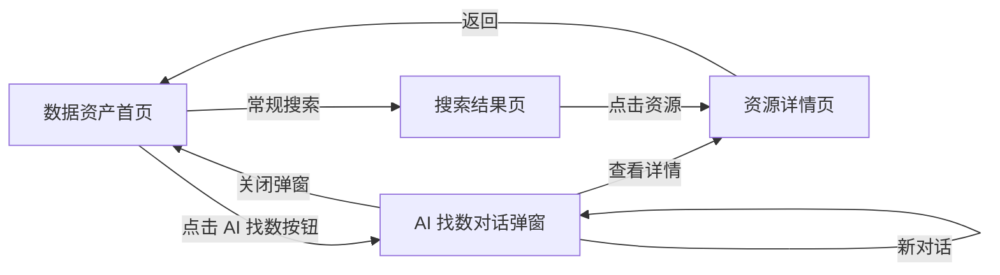
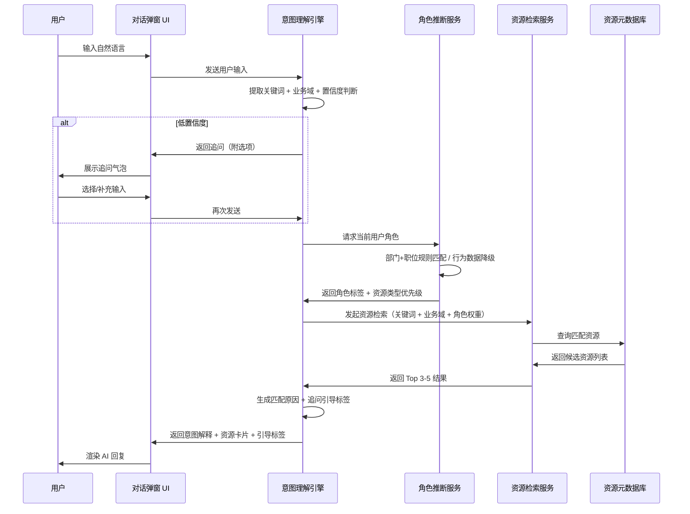

# AI 找数 — 产品架构方案

## 1. 页面结构与信息架构

### 1.1 页面清单

| 页面/组件 | 类型 | 说明 |
|---|---|---|
| 数据资产首页 | 主页面 | 包含搜索框 + AI 找数入口按钮 |
| AI 找数对话弹窗 | 模态弹窗 | 核心交互区域，承载多轮对话 |
| 资源摘要展开区 | 弹窗内嵌 | 卡片点击后就地展开的详情摘要 |
| 资源详情页 | 独立页面 | 已有页面，从弹窗跳转过去 |

### 1.2 页面层级关系

```
数据资产首页
  └── [点击 AI 找数按钮] → AI 找数对话弹窗（模态，覆盖在首页之上）
        ├── 对话区域（多轮消息流）
        │     ├── AI 欢迎语
        │     ├── 用户消息气泡
        │     ├── AI 回复（意图解释 + 资源卡片 + 追问标签）
        │     └── 资源卡片 → [点击展开] → 摘要区域
        │                       └── [查看详情] → 关闭弹窗，跳转资源详情页
        └── 输入区域（输入框 + 发送按钮）
```

---

## 2. 核心功能模块划分

| 模块 | 所属区域 | 功能 |
|---|---|---|
| AI 找数入口 | 首页搜索栏 | 紫色渐变按钮，点击唤起弹窗 |
| 对话引擎 | 弹窗 | 管理消息列表、发送/接收、加载态 |
| 意图理解 & 追问 | 弹窗 - AI 回复 | 置信度判断 → 直接给结果 or 追问缩小范围 |
| 资源推荐卡片 | 弹窗 - AI 回复 | 展示类型标签、名称、来源、匹配原因 |
| 卡片摘要展开 | 弹窗 - 卡片内 | 展开描述、负责人、热度、权限、字段预览 |
| 追问引导标签 | 弹窗 - AI 回复底部 | 胶囊标签，点击即发送 |
| 角色推断 | 后台服务 | 基于部门+职位+行为数据自动识别角色 |
| 对话历史 | 本地存储 | 持久化保存，支持新建对话 |
| Mock 数据层 | 原型阶段 | 关键词匹配模拟 AI 行为 + 角色切换 |

---

## 3. 关键流程图

### 3.1 用户操作流程图 (User Flow)

描述用户从发起 AI 找数到最终查看资源详情的完整操作路径。

```mermaid
flowchart TD
    A[用户在数据资产首页] --> B[点击 AI 找数按钮]
    B --> C[弹出对话弹窗，显示 AI 欢迎语]
    C --> D[用户输入自然语言描述]
    D --> E{AI 置信度判断}

    E -->|高置信度| F[直接返回推荐结果卡片]
    E -->|中置信度| G[返回结果 + 追问引导标签]
    E -->|低置信度| H[AI 追问缩小范围]

    H --> I{用户响应追问}
    I -->|点击选项/输入补充| E
    I -->|连续追问超过2次| F

    F --> J{用户查看卡片}
    G --> K[用户可点击引导标签继续追问]
    K --> D
    G --> J

    J -->|点击卡片| L[就地展开摘要信息]
    L --> M{用户判断}
    M -->|不是想要的| N[收起摘要，看其他卡片]
    N --> J
    M -->|确认是想要的| O[点击"查看详情"]
    O --> P[关闭弹窗，跳转资源详情页]

    J -->|继续追问| D
    J -->|结束| Q[关闭弹窗 / 点击遮罩 / Esc]
    Q --> R[对话历史自动保存]
```

### 3.2 页面导航关系图 (Page Navigation Map)

展示所有页面和组件之间的跳转与层级关系。



### 3.3 数据流向图 (Data Flow)

展示用户输入到 AI 返回推荐结果的数据处理流程（含原型 Mock 阶段和未来真实后端两条路径）。



---

## 4. MVP 范围界定

### 4.1 本期做（MVP）

- AI 找数入口按钮 + 对话弹窗完整交互
- 自然语言输入 → 意图理解 → 资源推荐（Mock）
- 6 种角色的推荐策略差异化展示
- 多轮对话 + 追问引导
- 卡片展开摘要 + 跳转详情页
- 对话历史持久保留
- Mock 数据层（30-50 条资源，关键词匹配）

### 4.2 本期不做

- 真实 LLM + 向量检索后端
- 指标值查询（"上个月 GMV 是多少"）
- 对话历史搜索和管理
- 推荐结果反馈机制（点赞/点踩）
- 血缘关联推荐
