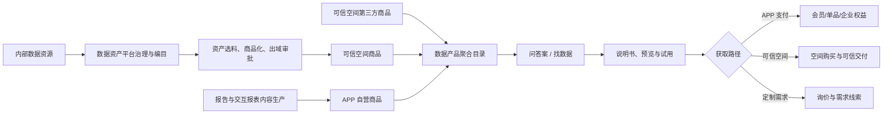

# 对外 APP 问数找数买数——六层次需求蓝图与产品设计

> 历史基线说明：本文保留 2026-07-09～2026-07-11 的原始蓝图。整合可信空间订单/账单、需求回流、售后治理、资源商品分离、资产平台数据集购买及 BI 交付后的统一上位需求，见 `docs/superpowers/specs/2026-07-31-asset-platform-dataset-commerce-bi-delivery-design.md`。若规则冲突，以 2026-07-31 完整需求全景为准。

## 文档信息

| 项目 | 内容 |
| --- | --- |
| 文档版本 | V0.2（原型范围已对齐） |
| 初始日期 | 2026-07-09 |
| 调整日期 | 2026-07-11 |
| 文档状态 | 蓝图 checkpoint 已通过，可进入设计规格与原型阶段 |
| 关联系统 | 综合对外 APP、数据资产管理平台、APP 运营后台、万联易达可信数据空间 |

---

## 一、背景与核心定位

部门规划建设综合对外 APP，本模块承担“问数、找数、买数”能力。综合 APP 首页只提供一个“找数”入口；进入模块后，用户可以在同一个输入区域选择“智能识别、问答案、找数据”。“买数”不是孤立入口，而是用户理解、评估数据后的获取动作。

外部客户感兴趣的不是内部表名或资产目录，而是能解决业务问题的数据产品。内部资产只能作为商品生产原料，经过筛选、场景化包装、说明书生成和对外发布审批后，才能以数据集、API、隐私核验、联合分析等形态对外展示。

本模块同时承载两类产品：

- **APP 自营内容产品**：行业报告、交互报表等，在 APP 内预览、购买、阅读和使用。
- **可信空间产品**：数据集、API、PQ/PIR、联合分析、解决方案等，在 APP 内发现和评估，在可信空间购买与交付。

因此完整漏斗为：

`提出问题或描述需求 → 获得答案/候选商品 → 看懂并试用 → APP 购买/空间购买/询价 → 阅读、分析或可信交付`

## 二、产品与数据链路

关键约束：

1. 资产与商品是一对多，同一资产可加工为不同交付形态。
2. 每个商品只能归属一条获取路径：APP 支付、可信空间购买或询价定制。
3. APP 自营商品以 APP 为主数据；可信空间商品以空间为主数据，APP 只维护展示增强信息。
4. 报告与交互报表是独立类型：报告侧重章节阅读与下载，交互报表侧重筛选、下钻、持续更新和导出。
5. 可信空间的数据集/API 只能由已认证企业发起购买；个人账号只作为该企业的经办人，购买意图必须同时保留企业主体与经办人。
6. 可信空间是数据集/API 商品、订单、交付和账单的事实权威；APP 只镜像订单、交付和 API 账单，APP 不创建空间权益。

## 三、系统边界

### 3.1 综合 APP

- 首页只示意“找数”入口，不重新设计整个综合 APP。
- 找数模块统一承载问答案、找数据、商品评估、购买衔接和“我的”。
- “我的”承接会员、单品、企业权益、APP 订单、空间订单、试用、需求和收藏。
- APP 自营报告可在结算时选择个人/企业购买主体，分别生成 APP 个人订单/个人权益或 APP 企业订单/企业权益；该规则不适用于空间数据集/API。

### 3.2 数据产品聚合层

- 聚合 APP 自营商品、可信空间自营商品和空间第三方商品。
- 统一搜索、场景分类、产品类型、说明书和权益判断。
- 空间商品的名称、类型、提供方、空间价格、状态和编号只读；APP 可维护展示标题、推荐语、标签、说明书、预览、排序和推荐位。

### 3.3 数据资产管理平台

- 负责资产选料、对外数据字典与样本底稿、商品化加工和出域审批。
- 通过审批的资产型商品按交易归属推送可信空间，不在 APP 运营后台重复建设资产治理能力。

### 3.4 APP 运营后台

- 负责报告与交互报表、目录增强、会员、单品订单、企业采购、企业权益、试用、运营推荐和需求线索。
- 与资产平台形成双后台协同，互相跳转查看商品加工、审批和发布状态。
- 对空间订单、交付和 API 账单只保留可见范围内的镜像与同步状态；账单下载及疑问处理深链回可信空间，APP 不建设账单异议表单或处理流程。

### 3.5 可信数据空间

- 负责空间商品主数据、定价、购买、授权、可信交付及 API 账单，是上述空间事实的权威来源。
- 目标体验为 APP 内嵌打开、单点登录、商品深链和订单/交付状态回传。
- 空间不可用时，APP 仍可展示最近一次同步的说明书；商品快照过期时仍可查看，但购买按钮必须锁定；价格或上架状态无法确认时同样禁止购买。

---

## 四、六层次需求蓝图

### 第 1 层：用户

| 角色 | 核心动作 | 核心诉求 |
| --- | --- | --- |
| A 外部数据用户 | 问问题、找商品、预览试用、个人购买、阅读使用 | 快速判断有没有合适的数据，以及是否值得购买 |
| B 企业管理员/采购人 | 企业认证、询价采购、合同付款、分配席位 | 合规采购并让企业成员共享数据权益 |
| C 商品/内容/商务运营 | 商品增强、内容上架、定价、线索跟进、权益开通 | 以可控成本持续供给商品并促成交易 |
| D 合规审批人 | 按商品类型检查并放行/驳回 | 控制对外发布风险并保留责任链路 |

个人账号是基础身份；用户加入并认证企业后获得企业上下文。个人权益与企业权益可同时存在。

### 第 2 层：痛点与价值

- **P1 外部发现困难**：客户不知道公司能提供哪些数据，合作依赖线下商务偶发对接。
- **P2 评估成本高**：现有空间货架信息不足，客户难以判断覆盖、质量、适用性和接入成本。
- **P3 内容价值未变现**：报告和交互报表缺少预览、会员、单品和企业共享能力。
- **P4 资产商品化效率低**：选料、说明书、样本和合规审批依赖人工，缺少标准流水线。
- **P5 需求无法回流**：搜索失败、询价和试用信号没有进入统一线索池，供给规划缺乏依据。

对应价值：

- **V1**：统一入口融合问数和找数，降低从问题到答案/商品的发现成本。
- **V2**：按类型提供说明书、预览和试用，帮助客户自助完成适用性判断。
- **V3**：以 APP 内容交易和空间可信交易覆盖不同商品形态。
- **V4**：以双后台协同标准化资产商品化和内容运营。
- **V5**：将无结果、询价和试用回流为需求线索，驱动商品规划。

### 第 3 层：场景

| 编号 | 来源 | 场景 |
| --- | --- | --- |
| S1 | V1 | 用户从综合 APP 首页进入“找数”，用自然语言提问或描述需要的数据 |
| S2 | V1/V2 | AI 识别问答案/找数据意图，返回有来源的答案、商品或混合结果 |
| S3 | V2 | 用户查看报告预览、受限报表、数据字典、脱敏样本或 API 测试说明 |
| S4 | V3 | 用户购买会员或单品，回到原问题解锁完整答案和内容 |
| S5 | V3 | 企业用户认证后申请试用，并在可信空间购买数据产品 |
| S6 | V3 | 企业采购内容权益，完成报价合同后由管理员分配席位 |
| S7 | V5 | 没有结果时，系统用当前问题和筛选条件预填需求单，运营后续推荐或定制 |
| S8 | V4 | 运营同步空间商品并维护 APP 增强信息，或创建报告/交互报表 |
| S9 | V4 | 审批人按数据商品、报告或交互报表的分类检查项完成发布审批 |
| S10 | V5 | 运营统一处理试用、询价和无结果需求，并把进度反馈给用户 |

### 第 4 层：应用与功能

| 模块 | 服务场景 | 说明 |
| --- | --- | --- |
| M1 统一问数找数 | S1/S2 | 单一输入区，支持智能识别、问答案、找数据和模式切换 |
| M2 聚合商品目录 | S1/S2 | 统一搜索并按场景、类型分频道，覆盖 APP 与空间商品 |
| M3 商品详情与评估 | S3 | 通用说明书加按类型附件、预览和试用动作 |
| M4 AI 权限回答 | S2/S4 | 仅引用公开、个人已购或当前企业已授权内容，未购内容渐进披露 |
| M5 APP 内容交易 | S4/S6 | 单一会员、单品购买、会员折扣和企业采购 |
| M6 空间购买衔接 | S5 | 企业认证、内嵌空间、单点登录、商品深链和订单回传 |
| M7 企业权益 | S6 | 企业套餐、席位、成员邀请、分配、收回、到期和续费 |
| M8 需求与线索 | S7/S10 | 无结果需求、询价、试用申请和运营跟进 |
| M9 商品化与内容后台 | S8 | 资产平台商品加工与 APP 运营后台双后台协同 |
| M10 对外发布审批 | S9 | 统一入口、分类检查清单、驳回重提和发布留痕 |

### 第 5 层：运营

- **组织**：商品运营、内容编辑、商务运营、合规审批人和平台管理员分工；小团队可兼岗，但权限动作分离。
- **供给流程**：需求洞察 → 商品规划 → 资产加工/内容生产 → 分类审批 → 空间或 APP 发布 → 运营推荐。
- **转化流程**：曝光 → 问答/搜索 → 详情 → 预览/试用 → 个人或企业转化 → 使用与续费。
- **需求流程**：无结果/询价/试用 → 线索分派 → 推荐现有/定制/暂不支持 → APP 消息反馈。
- **指标**：找数成功率、有效回答率、详情到试用转化、试用到购买转化、会员续费、企业席位激活、需求响应时效和商品上新周期。

### 第 6 层：资源与约束

- 资产平台元数据、质量结果、数据字典和脱敏样本生成能力。
- 可信空间产品目录、单点登录、商品深链、订单、交付和需求接口。
- APP 支付、会员权益、企业认证、合同付款确认和消息通知能力。
- AI 检索与回答必须支持来源引用、权益过滤和无依据拒答。
- 对外数据经营制度、内容审核规范、定价权限和企业采购规则是发布前置。

---

## 五、商品详情与试用规格

### 5.1 通用信息

所有商品展示名称、价值主张、适用场景、提供方、覆盖范围、更新频率、质量/服务承诺、合规声明、试用政策、价格和交付方式。

### 5.2 类型差异

| 产品类型 | 评估重点 | 试用/预览 | 购买后使用 |
| --- | --- | --- | --- |
| 行业报告 | 摘要、目录、样例页、方法、版本、授权范围 | 免费摘要和样例页 | APP 阅读器与合规下载 |
| 交互报表 | 指标口径、维度、时间范围、更新周期、导出规则 | 限时间、维度和下钻层级 | APP 在线看板 |
| 数据集 | 对象粒度、覆盖、字典、样本、质量和关联方式 | 脱敏样本；企业申请正式试用 | 空间订单/交付状态 |
| API | 入参出参、示例、错误码、覆盖、性能、SLA 和计费 | 企业认证后测试额度 | 空间调用与交付状态 |
| PQ/PIR | 核验字段、返回形态、参考命中率和隐私机制 | 模拟数据自助体验 | 空间核验服务 |
| 联合分析 | 分析模板、参与字段、输出、披露限制和周期 | 方案与示例结果，预约试算 | 空间任务/项目交付 |
| 解决方案 | 场景、组成产品、实施范围和案例 | 预约演示 | 询价与项目交付 |

后台可逐商品配置“不支持试用、自助试用、申请后试用”。

## 六、交易、身份与权益规则

### 6.1 APP 交易

- 单一会员覆盖配置范围内的报告和交互报表。
- 商品可配置会员免费、会员折扣或不纳入会员；非会员可单品购买。
- 小额企业标准套餐可在线支付；大额/定制采购走报价、合同、对公付款和运营确认开通。

### 6.2 企业权益

- 企业管理员购买后分配席位，成员共享企业已购内容。
- 移动 APP 企业中心支持查看套餐、邀请成员、分配/收回席位和查看成员状态。
- 同时命中个人与企业权益时，优先使用无需额外付费且权限更高的权益，并标明来源。

### 6.3 AI 付费墙

- 免费内容和已购/已授权内容可生成完整答案、图表和来源。
- 未购买内容只基于公开摘要提供方向性回答；精确数值、完整图表、细分维度和深度追问锁定。
- 没有公开依据时不生成推测答案，转为商品推荐或需求提交。
- 购买成功后回到原问题，一键重新生成完整答案。

### 6.4 下架与已购处置

调整于 2026-07-11：新增下架规则。下架不是删除商品，是一条受控流程，必须先定原因等级，再决定对已购权益的处置。

**下架原因分级**：

- **常规下架**（销量差、迭代换代、供给方停供等商业原因）：只停止新购，已购权益一律保护，不涉及退款。
- **合规/安全下架**（数据侵权、授权到期、监管要求、质量事故）：属强制下架，允许终止已购，通常紧急且被动，需合规审批。

**已购处置按交付形态区分，而非按商品类型**：

- **一次性已交付**（报告下载、数据集文件）：物理上不可收回。下架后仅能停止再次下载与后续更新推送；合规强制下架时最多撤销下载入口并通知，不保证追回已散出副本——该风险须在售卖时的授权协议中提前约定。
- **持续访问型**（交互报表在线看板、会员内容、API、空间"可用不可见"）：权益仍在平台/空间侧可控，提供三档处置：存量用到期（grandfather，默认推荐）、宽限期后停止（30/60 天过渡，期间只读/限流）、立即终止（仅合规/安全，断访问并按剩余周期退款或补偿）。

**主数据责任方**：APP 自营商品（报告/交互报表）由 APP 运营后台直接执行下架与已购处置；可信空间商品的授权回收与访问终止在空间侧执行，APP 只做下架增强展示、同步空间回传的订单/交付变更到“我的”并通知用户，绝不创建或回收本地空间权益。

**在途订单处置**：待支付订单关闭并释放；已支付未交付订单按类型决定继续交付或退款；试用中按配置决定走完当前额度或立即停止。

**退款规则**（需财务/法务共同确定，原型先留策略位）：常规下架不退款；订阅/会员类被强制终止按剩余周期比例退款；一次性买断被合规强制终止通常全额退款并书面通知。

所有下架必须通知受影响的已购用户、保留下架原因与操作留痕（操作人、原因、已购处置方式）、并保留说明书快照供追溯。

## 七、状态与异常规则

- 用户状态：未登录、个人已登录、企业未认证、企业已认证。
- 试用状态：未申请、待审批、已通过、已驳回、额度用尽、已过期。
- APP 订单：待支付、支付取消、支付失败、已支付、已退款、权益已生效。
- 空间购买意图（仅限认证企业，个人仅为经办人）：`validating`、`ready`、`redirected`、`returned_pending_sync`、`linked`、`failed`、`expired`。可信空间回跳只能进入 `returned_pending_sync`，它不等于购买成功。
- 可信空间只读订单/交付镜像：`accepted`、`pending_payment`、`paid`、`delivering`、`delivered`、`failed`、`cancelled`、`unknown_processing`。镜像只由已验签事件或主动对账更新，不得以 APP 的“购买成功”命名、不得驱动 APP 空间权益。
- 企业权益：待开通、有效、席位已满、席位被收回、已到期、因下架终止。
- 商品状态：草稿、待审批、已驳回、待发布、已发布、暂停销售（停新购、已购继续）、下架宽限期（存量只读/限流）、已下架。
- 已购权益状态（下架相关）：正常、随商品下架继续有效、宽限期内、已终止待退款、已退款。

所有异常状态保留历史记录并提供可恢复动作。空间价格或上架状态无法确认时禁止购买；AI 无可靠来源时拒绝生成结论。下架须按 6.4 分级处置已购权益并留痕。

## 八、原型范围与演示链路

### 8.1 移动端页面

总首页示意、找数模块首页、问答案结果、找数据结果、筛选/频道、商品详情、预览/试用、企业认证、会员/单品购买、空间购买承接、企业采购、需求提交和“我的”。

完整制作行业报告、交互报表、数据集和 API 详情；PQ/PIR、联合分析和解决方案采用简化模板。

### 8.2 APP 运营后台

商品中心、内容中心、商业化中心、企业权益、试用与线索、运营配置、审批与集成七个业务域。重点制作商品编辑、发布审批、企业采购/权益开通和需求线索处理。

### 8.3 四条完整链路

1. 问货运价格趋势 → 受限回答 → 开通会员 → 解锁完整回答。
2. 找资格核验 API → 详情评估 → 企业认证 → 空间购买 → 订单回传。
3. 企业采购报告权益 → 合同付款确认 → 分配席位 → 成员共享。
4. 搜不到数据 → 提交需求 → 后台处理 → 推荐现有或定制商品。

代表商品：全国货运价格指数、中国公路物流行业月报、道路运输从业人员资格核验、企业物流活跃度数据集、承运商经营稳定性联合分析。

## 九、验收标准

- 综合 APP 首页只示意并标出“找数”入口，不重构其他功能。
- 问答案和找数据共享统一入口，用户可显式切换模式。
- 四条主链路可从入口走到结果，并在“我的”看到对应状态。
- 同一商品不会同时出现 APP 支付与空间支付。
- AI 不越权引用未购内容，购买后可回原问题解锁。
- 未完成企业认证的个人不能进入企业试用或空间购买。
- 企业管理员可查看采购状态、分配席位并让成员共享内容。
- 后台配置的来源、交易归属、预览、试用和权益规则能在移动端对应体现。
- 下架分常规与合规强制两级，能按交付形态对已购权益选择继续/宽限/终止，并对在途订单和退款有明确处置。
- 关键加载、空结果、失败、驳回、过期、下架和回传延迟状态有明确反馈和恢复动作。

## 十、已确认结论

本轮已确认：原生移动 APP 方向；一个“找数”入口；问数与找数融合；APP/空间双交易路径；个人账号加企业认证；报告与交互报表独立；统一搜索加分频道；AI 分权限回答；单一会员加单品购买；企业采购与席位共享；空间内嵌单点登录；风险分层试用；双来源增强层；分类审批；需求闭环；双后台协同；独立 React/Vite 交互原型。

制度、真实接口排期和飞书 PRD 同步属于落地依赖，不再作为原型设计的待定产品决策。
