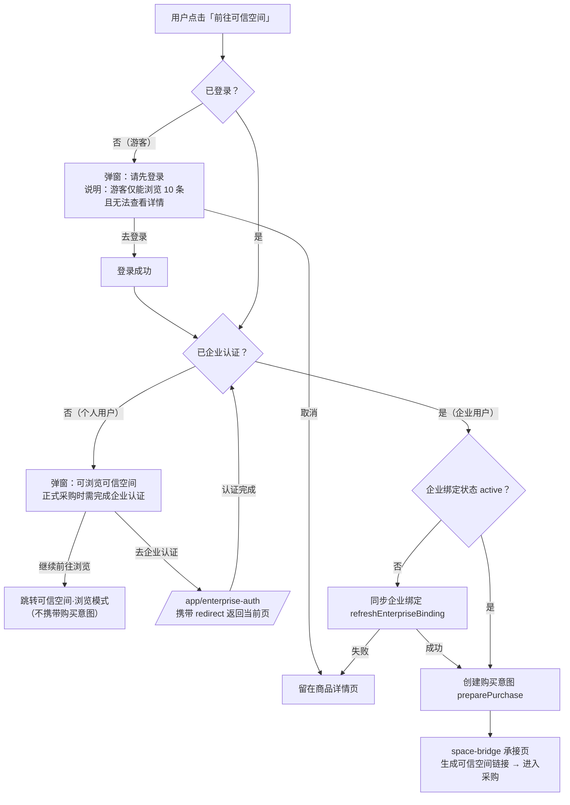

# 数据资产平台 — PC 门户商品详情页 · 模块 PRD

## 1. 文档信息

| 项 | 内容 |
|----|------|
| 文档版本 | V0.1 |
| 文档日期 | 2026-07-28 |
| 文档状态 | 需求说明稿（模块级） |
| 归属模块 | PC 门户找数买数 |
| 关联文档 | `docs/superpowers/specs/2026-07-28-pc-portal-design.md`（PC 门户整体设计）<br>`docs/product/2026-07-10-对外APP找数买数-功能矩阵.md`（功能矩阵） |
| 界面参考 | App 端 `ProductDetail.vue` 及其子组件（`DatasetDetail`/`ApiDetail`/`ReportDetail`/`DashboardDetail`） |
| 技术实现 | Vue 3 + TypeScript + Pinia + Tailwind CSS，独立 PC 视图层 `src/views/portal/` |

---

## 2. 模块定位

### 2.1 一句话定位

PC 门户商品详情页是用户在 PC 端浏览数据资产、了解详情、完成购买的核心页面。采用**水平 Tab + 左右分栏**布局：左栏承载类型特有内容（与 App 一致的 Tab 结构），右栏为 sticky 购买面板。所有交互功能（API 沙箱调试、报告在线阅读、看板预览解锁、数据探查）与 App 端全功能对齐，并利用 PC 宽屏做布局增强。

### 2.2 非目标

- 不替代运营后台的资源管理（ResourceCenter）。
- 不在本 PRD 中展开可信空间购买对接细则（见可信空间相关文档）。
- 不涉及 App 端详情页的改动（App 端已有完整实现）。

---

## 3. 页面布局

### 3.1 整体结构

```
┌──────────────────────────────────────────────────────────┐
│  商品标题卡                                                │
│  [类型徽标] [渠道标签] [上架状态]  ★ 收藏                    │
│  商品名称（displayTitle）                                    │
│  副标题                                                     │
├────────────────────────────────┬─────────────────────────┤
│  Tab: Tab1 | Tab2 | Tab3 | Tab4│  ¥299 /12月              │
│ ────────────────────────────── │  会员免费 · 开通会员立享     │
│ │                              │                          │
│ │  类型特有内容                  │  [主操作按钮]              │
│ │  （4 个组件按类型切换）          │  [次操作按钮]              │
│ │                              │                          │
│ │                              │  ✅ 已拥有权益（条件）      │
│ │                              │  ⚠️ 服务状态通知（条件）    │
│ │                              │  📊 API 用量入口（条件）    │
│ │                              │                          │
│ │                              │  ── 购买信息 ──            │
│ │                              │  购买方式 / 来源 / 更新时间  │
└────────────────────────────────┴─────────────────────────┘
```

### 3.2 组件构成

| 组件 | 路径 | 职责 |
|------|------|------|
| PortalProductDetail.vue | `views/portal/` | 页面框架：标题卡 + Tab 导航 + 组件切换 + 右栏购买面板 |
| PortalDatasetDetail.vue | `views/portal/components/` | 数据集类型 4 Tab 内容 |
| PortalApiDetail.vue | `views/portal/components/` | API 类型 4 Tab 内容（沙箱左右分栏） |
| PortalReportDetail.vue | `views/portal/components/` | 报告类型 3 Tab 内容（阅读器双栏） |
| PortalDashboardDetail.vue | `views/portal/components/` | 看板类型 4 Tab 内容（网格预览） |
| PortalDetailTabs.vue | `views/portal/components/` | 水平 Tab 导航（PC 样式） |
| PortalPurchasePanel.vue | `views/portal/components/` | 右栏 sticky 购买面板 |

---

## 4. Tab 结构（按类型）

### 4.1 Tab 定义矩阵

| 类型 | Tab 1 | Tab 2 | Tab 3 | Tab 4 |
|------|-------|-------|-------|-------|
| 数据集 (dataset) | 基本信息 | 字段信息 | 样例数据 | 探查报告 |
| API (api) | 基本信息 | 接口文档 | 在线调试 | 错误码与SLA |
| 报告 (report) | 报告介绍 | 目录 | 在线阅读 | — |
| 看板 (dashboard) | 基本信息 | 看板预览 | 指标定义 | 更新与导出 |

### 4.2 第一个 Tab 的公共内容

所有类型的第一个 Tab 均包含以下两个区块：

**区块一：基础信息网格（3 列）**

| 类型 | 字段 |
|------|------|
| 数据集 | 数据粒度 / 时间范围 / 数据行数 / 分类分级 / 质量更新时间 / 样本生成时间 |
| API | 请求方法 / 接口版本 / 认证方式 / 调用限制 / 路径示例（跨列） |
| 报告 | 发布日期 / 报告页数 / 研究机构 / 报告版本 / 适用读者（跨列）/ 下载授权（跨列） |
| 看板 | 时间范围 / 更新周期 / 指标数量 / 图表面板数 / 导出规则（跨列） |

同时包含通用基础信息（供应方 / 更新频率 / 覆盖范围 / 交付方式 / 来源 / 更新时间）。

**区块二：商品说明书**

- 价值主张
- 详细描述
- 质量/服务承诺
- 合规声明
- 应用场景标签

---

## 5. 类型特有内容

### 5.1 数据集 (PortalDatasetDetail)

| Tab | 内容 | PC 增强 |
|-----|------|---------|
| 字段信息 | 字段名 / 类型 / 业务含义 / 描述 / 主键 / 可空 / 敏感级 | 全 7 列展示，无需横向滑动 |
| 样例数据 | 脱敏样例行数据 + 警告提示 | 全宽表格，可见行数更多 |
| 探查报告 | 整表概览 + 字段维度探查面板 | 左侧字段切换器 + 右侧宽图表 |

### 5.2 API (PortalApiDetail)

| Tab | 内容 | PC 增强 |
|-----|------|---------|
| 接口文档 | 请求参数表 + 响应字段表 | 双表左右并排 |
| 在线调试 | 沙箱参数输入 + 发送/模拟失败 + 脱敏结果 | 左右分栏：左参数输入 / 右深色终端结果 |
| 错误码与SLA | 错误码表 + SLA/限流/计费信息 | 同 App，表格更宽 |

### 5.3 报告 (PortalReportDetail)

| Tab | 内容 | PC 增强 |
|-----|------|---------|
| 目录 | 章节列表，带可读/锁定状态标记 | 与 App 一致 |
| 在线阅读 | 内容区块 + 图表占位 + 解锁入口 | 左右双栏：左侧目录侧边栏（始终可见）+ 右侧正文区 |

在线阅读 Tab 的 PC 双栏布局：
- **左侧栏（约 180px）**：章节目录列表，每项显示序号、标题、可读状态（✓可读 / 🔒会员 / 🔒单篇）。当前章节高亮。点击可跳转到右侧对应区块。
- **右侧正文区**：内容区块上下排列。公开样例正常渲染正文和图表占位；锁定章节只显示标题轮廓和"阅读本章"解锁按钮。

### 5.4 看板 (PortalDashboardDetail)

| Tab | 内容 | PC 增强 |
|-----|------|---------|
| 看板预览 | 面板卡片 + ContentGate 解锁门 | 2 列网格，面板更大 |
| 指标定义 | 指标名称 / 定义 / 公式 / 维度 + ContentGate | 2 列卡片网格 |
| 更新与导出 | 更新周期 / 导出规则 / 权益期限提示 | 同 App |

---

## 6. 内容解锁机制 (ContentGate)

### 6.1 解锁状态

| 状态 | 含义 | 展示 |
|------|------|------|
| `visible` | 公开预览 / 已解锁 | 正常展示摘要或正文 |
| `blurred` | 模糊预览 | 显示内容但加遮罩，底部解锁按钮 |
| `locked` | 完全锁定 | 只显示标题和锁定提示，底部解锁按钮 |

### 6.2 解锁条件

- 免费商品（`acquisitions.includes('free')`）：所有内容 `visible`
- 会员商品（`price.model === 'member_free'`）：会员已开通则 `visible`，否则 `blurred`
- 单品商品（`price.model === 'item_only'`）：已购买则 `visible`，否则 `locked`
- 报告章节：`previewable` 标记的章节始终 `visible`，其余按上述条件

### 6.3 解锁按钮行为

点击解锁按钮时，调用 `resolveProductActions()` 解析当前可用的解锁路径（与 App 一致），执行主操作按钮的动作。

---

## 7. 购买面板 (PortalPurchasePanel)

### 7.1 面板结构（从上到下）

1. **价格区** — 大号价格 + 计价单位 + 会员提示
2. **已拥有权益提示** — 条件渲染（`owned` 时显示绿色提示框）
3. **操作按钮** — 通过 `resolveProductActions()` 解析，上下文感知
4. **购买信息** — 购买方式 / 来源 / 更新时间
5. **服务状态通知** — 条件渲染（`serviceStatus !== 'normal'` 或 `availability` 非正常时）
6. **API 用量入口** — 条件渲染（`type === 'api' && owned` 时，跳转 `/portal/bills`）
7. **收藏** — `catalog.toggleFavorite()`

### 7.2 购买路径完整映射（与 App 一致）

> 以下映射通过 `resolveProductActions()` 复用 App 的 action 解析逻辑，确保两端按钮一致。

| 场景 | 主按钮 | 次按钮 | 跳转路径 |
|------|--------|--------|----------|
| 免费商品 | 直接查看 | — | `/portal/mine` |
| 会员免费（未开通） | 开通会员 | 单品购买 | `/app/checkout/member` |
| 会员免费（已开通） | 已覆盖 ✅ | — | 无跳转 |
| 会员折扣 | 立即购买 | 开通会员 | `/portal/checkout/:id` |
| 仅单品购买 | 立即购买 | — | `/portal/checkout/:id` |
| 可信空间 | 前往可信空间 | 企业认证 | space-bridge（需企业认证） |
| 未上架（下架/暂停） | 求上架 | 查看进度 | `/app/listing-request/:id` |
| 已拥有 | 查看内容 | — | `/portal/mine` |

### 7.3 按钮显隐规则

- 主按钮始终显示（根据场景渲染不同文案和动作）
- 次按钮条件渲染：
  - "单品购买"仅当 `price.model !== 'item_only'` 且未拥有时显示
  - "企业认证"仅当 `dealChannel === 'space_purchase'` 且未企业认证时显示
  - "查看进度"仅当已有上架申请时显示
- 已拥有权益时，主按钮变为"查看内容"，无次按钮

### 7.4 价格展示规则

| 价格模型 | 展示 |
|----------|------|
| `free` | "免费" |
| `member_free` | "会员免费" + "开通会员后免费使用" |
| `member_discount` | "¥{itemPrice}" + "会员折扣 {memberDiscount}折" |
| `item_only` | "¥{itemPrice}" + "单品购买" |
| `quote` | 无套餐："按报价" + quoteNote；有套餐（API）："多套餐可选" + 套餐卡片列表 |

**API 多套餐规则**：`ApiDetail.pricingPlans` 存在时，购买面板价格区下方**同时展示全部套餐**（不做切换/折叠），每张套餐卡片含：套餐名、规格（如 10 万次/月）、价格（如 ¥0.32/次）、折合说明（可选）；推荐套餐高亮边框 + 「推荐」角标。套餐价格属于可信空间可同步的计费层元数据（见 §11.1）。

### 7.5 可信空间跳转门禁流程

**背景约束（可信空间侧规则）**：

1. 游客（未登录）进入可信空间仅能浏览 10 条数据，且商品详情页可能不可达（断头路体验）；
2. 可信空间的正式采购流程仅对**企业用户**开放；
3. 两侧系统共用同一套用户体系，登录态与企业认证状态可互认。

**门禁设计（分层拦截，在本侧跳转网关统一处理）**：

| 用户状态 | 门禁类型 | 行为 |
|----------|----------|------|
| 游客（未登录） | **硬门禁** | 弹窗要求先登录，登录后自动继续原跳转动作 |
| 个人用户（已登录、未企业认证） | **软提示** | 弹窗告知“可浏览，正式采购需企业认证”，提供【继续前往浏览】和【去企业认证】两个选项 |
| 企业用户（已认证） | 无拦截 | 直接走绑定校验 → 购买意图 → space-bridge 承接页 |

> 设计原则：登录是硬门禁（避免游客过去碰壁）；企业认证是软门禁（浏览/比价不需要企业身份，仅在正式采购环节硬性要求，提前提示设置预期）。

**跳转门禁流程图**：



**按钮层适配**：对 `dealChannel === 'space_purchase'` 的在售商品，游客与个人用户的主按钮文案统一为“前往可信空间”（不再直接展示 disabled 的“认证企业后购买”或“完成企业认证”），由跳转门禁弹窗分流；企业用户保持 domain 层 `resolveProductActions` 原逻辑（含 binding_required 等阻断态）。


---

## 8. 复用层

### 8.1 Store（零改动复用）

| Store | 用途 |
|-------|------|
| `useCatalogStore` | 商品数据、`displayTitle()`、`toggleFavorite()` |
| `useEntitlementStore` | `accessLevel()` 判断已拥有权益 |
| `useUserStore` | 用户上下文、企业认证状态 |
| `useListingRequestStore` | 上架申请查询 |
| `useTrustedSpaceCatalogStore` | 可信空间目录同步 |
| `useTrustedSpacePurchaseStore` | 可信空间购买准备 |
| `useApiUsageBillsStore` | API 用量数据（账单入口） |

### 8.2 Domain 层

| 模块 | 用途 |
|------|------|
| `resolveProductActions()` | 根据商品类型、可用性、权益状态解析操作按钮 |
| `ProductActionKey` | 按钮动作类型 |

### 8.3 共享组件

| 组件 | 用途 |
|------|------|
| `StatusBadge` | 上架状态、服务状态徽标 |

### 8.4 类型

| 类型 | 用途 |
|------|------|
| `Product` / `ProductType` | 商品数据结构 |
| `DatasetDetail` / `ApiDetail` / `ReportDetail` / `DashboardDetail` | typeDetail 子类型 |
| `PriceModel` / `AcquisitionOption` | 价格和购买方式 |
| `SpaceBindingStatus` | 可信空间绑定状态 |

---

## 9. 商品标题卡

### 9.1 结构

商品标题卡位于左栏顶部，所有类型通用：

- **徽标行**：类型徽标（`typeMeta[type].icon + label`）+ 渠道标签（`dealChannelMeta[dealChannel]`）+ 上架状态（`StatusBadge dict="availability"`）
- **标题**：`catalog.displayTitle(product)`，大号加粗
- **副标题**：`product.subtitle`
- **收藏**：右上角星标按钮，`catalog.toggleFavorite()`

### 9.2 服务状态通知

当 `serviceStatus !== 'normal'` 或 `availability === 'paused'` 或 `availability === 'delisted'` 时，在标题卡下方显示服务状态通知卡片。

---

## 10. 边界与约束

1. **user_view 类型**：不在 PC 详情页范围内（内部视图通过搜索结果直接跳转外链，无独立详情页）
2. **可信空间购买**：购买流程跳转 space-bridge，不在本页面内完成
3. **会员购买**：跳转 `/app/checkout/member`（复用 App 端会员购买页）
4. **上架申请**：跳转 `/app/listing-request/:id`（复用 App 端上架申请页）
5. **报告版本绑定**：单品购买永久绑定当前版本，后续独立版本需另行购买
6. **看板权益期限**：单品购买后有效 N 个月，期间持续获得更新

## 11. 可信空间元数据同步映射

> 背景：可信空间侧商品详情页（万联易达可信数据空间）对外暴露了完整的描述层、合规层与字段级元数据。对 `dealChannel = space_purchase` 的商品，本平台商品管理可直接同步这些元数据，免去手录；运营仅需补充卖点包装层。

### 11.1 权威源分层

| 层 | 权威源 | 本地编辑性 | 字段 |
|---|---|---|---|
| 交易层（已有快照） | 可信空间 | 只读 | 名称、类型、供应方、售卖状态、价格、币种、版本、更新时间（`TrustedProductSnapshot`） |
| 描述/合规层（本次新增） | 可信空间 | 只读 | `Product.spaceMeta`：行业分类、地域分类、数据主体、是否涉及个人信息、授权使用、使用限制（结构化枚举 + 其他说明）、数据规模、计费模式说明 |
| 字段层（本次新增） | 可信空间 | 只读 | 数据集字段结构（字段名/中文名/类型/主键/示例值 `DatasetField.sampleValue`） |
| 计费层（本次新增） | 可信空间 | 只读 | API 多套餐价格 `ApiDetail.pricingPlans`（套餐名/规格/价格/折合说明/推荐标记），详情页同时展示全部套餐 |
| 运营加工层 | 本地运营 | 可编辑 | 副标题、价值主张、场景标签、质量承诺、脱敏样例、探查报告、字段敏感级、探查开关、`ProductEnhancement` 全部字段 |
| 商业化策略层 | 本地运营 | 可编辑，不同步 | `acquisitions`、`dealChannel`、`memberIncluded`、`entitlementPolicy`、会员定价 |

### 11.2 详情页展示规则

- 基本信息网格：`spaceMeta` 存在时，在公共 6 项之后追加行业分类、地域分类、数据主体、是否涉及个人信息、授权使用、数据规模 6 项；使用限制以通栏（full）展示，枚举项顿号连接，其他说明追加在后
- 字段信息表：任一字段存在 `sampleValue` 时增列「示例值」，无值字段显示 —
- 购买面板：`spaceMeta.billingNote` 存在时，价格下方展示计费模式说明栏（如「数据表类产品采用一次性价格模式」）
- 非空间商品（无 `spaceMeta`）展示完全不变

### 11.3 不同步项（明确排除）

- 浏览次数/申请次数：跨系统统计口径不一致，易误导
- 交付方式说明附件（查看文件）：涉及对方附件系统，暂缓
- 敏感级、可空、探查开关：本平台优势项，保持本地维护
