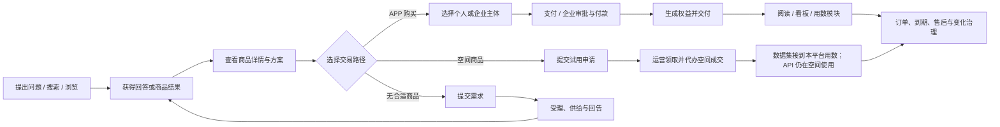
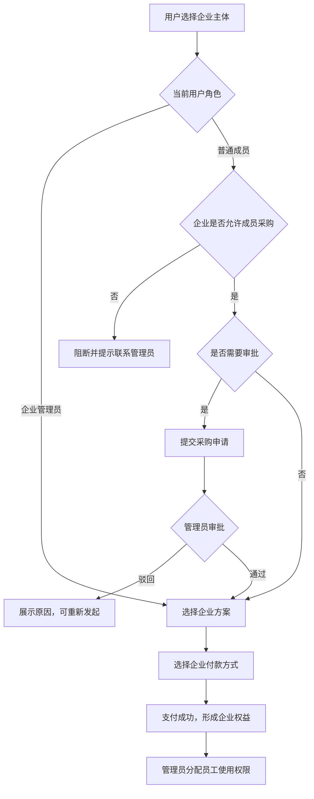

# 对外 APP 找数、买数与用数——完整模块 PRD

## 1. 文档信息

| 项目   | 内容                                                         |
| ---- | ---------------------------------------------------------- |
| 文档类型 | 模块完整 PRD                                                   |
| 文档版本 | V1.0 完整评审稿                                                 |
| 编写日期 | 2026-08-13                                                 |
| 当前状态 | V1.0 完整评审稿；本地已与原型对齐，待同步飞书                                 |
| 对应规划 | 《对外 APP 找数、买数与用数 · 产品规划》V1.0                               |
| 规划范围 | 对外 APP、PC 门户、企业管理中心、运营管理后台，以及与数据资产平台、可信数据空间、用数模块、看板平台的产品协同 |
| 需求深度 | 完整描述模块全景；详细定义第一阶段需求；第二、三阶段仅说明演进范围和启动条件                     |
| 原型基础 | `external-app-vue3`；原型用于验证规则和演示状态，不代表真实接口、支付或交付已经接通        |

### 1.1 阅读说明

本文是当前找数、买数与用数模块的统一需求依据，整合此前规划、六层蓝图、商品详情、可信空间对接、资源商品分离、企业采购、售后治理和资产变化监控等专题结论。

若历史文档与本文冲突，以本文为准。本文使用产品语言描述用户能力、页面、流程、规则、状态、权限、异常和验收标准；接口字段、数据库、组件和技术方案不属于本 PRD。

文中阶段标识：

- **第一阶段**：本次详细需求和生产闭环范围。
- **第二阶段**：真实运营稳定后建设的治理增强能力。
- **第三阶段**：业务规模得到验证后建设的规模化能力。
- **暂不纳入**：不作为三个阶段的默认承诺，需单独立项。

## 2. 建设背景与产品目标

### 2.1 业务背景

当前可供用户使用的数据分别存在于 APP 自营内容、数据资产平台和可信数据空间。用户虽然可以在 APP 中提出问题或搜索数据，但商品发现、购买主体、成交渠道、权益交付、后续使用、订单账单和问题处理分散在不同系统，尚未形成完整闭环。

主要问题包括：

1. 用户不知道平台能提供哪些数据，也不知道不同来源的数据应该在哪里购买。
2. 商品详情对价格、质量、口径、许可、版本、更新和交付的说明不足，用户难以自行判断是否适用。
3. 同一用户可能同时拥有个人和企业身份，若购买主体选择错误，会进一步影响支付、发票、权益归属和可见范围。
4. 企业若只允许管理员购买，采购效率低；若完全开放，又缺少企业治理。
5. 购买后没有稳定衔接权益、用数模块、成员授权和首次使用，交易完成不等于数据可用。
6. APP 订单需要统一查询；可信空间当前不能识别 APP 导流订单，因此空间订单和 API 账单必须回到空间权威页面查看。
7. 搜索无结果、咨询和使用反馈没有稳定进入供给规划。
8. 上游资产、空间商品或许可变化后，缺少对新购和存量用户的影响判断与处置闭环。

### 2.2 产品定位

找数、买数与用数模块不是一个孤立的数据商城，而是从业务需求出发的统一数据消费入口。

产品统一以下体验：

- 统一问数、找数和商品发现入口。
- 统一四类标准商品的展示和评估框架。
- 统一个人与企业购买前的主体选择规则。
- 统一 APP 内订单和我的数据，并提供可信空间订单、API 账单的独立外跳入口。
- 统一需求回流和商品变化处置入口。

产品不强行统一以下事实：

- APP 不复制可信空间的成交、支付、交付和账单处理流程。
- APP 不同步、修改、镜像或重算可信空间订单和账单，只同步商品、方案、价格和购买资格。
- 找数买数模块只负责把已购数据和权限交付到用数模块，不负责用数模块内部的分析、报表制作和细粒度权限管理。

### 2.3 总体目标

让个人和企业用户从“我需要什么数据”出发，在一个入口实现：

**找得到、看得懂、买得对、用得上、查得清、管得住、能闭环。**

| 目标  | 用户结果                                    | 业务判断方式              |
| --- | --------------------------------------- | ------------------- |
| 找得到 | 能从提问、搜索或浏览进入有效答案或商品                     | 找数成功率、无结果率、来源覆盖率    |
| 看得懂 | 能判断商品是否适用、如何收费和如何交付                     | 详情完成率、详情到购买/咨询转化率   |
| 买得对 | 购买主体、渠道、支付方式和权益归属一致                     | 主体错配率、渠道错配率、支付成功率   |
| 用得上 | 购买后能获得内容或数据权益并进入使用                      | 权益到账时长、交付成功率、首次使用时长 |
| 查得清 | 能在 APP 查看 APP 订单和数据，并能明确进入可信空间查询空间订单与账单 | APP 订单可追踪率、空间入口可达率  |
| 管得住 | 企业采购可配置，异常和变化可治理                        | 审批时长、越权事件、风险发现与恢复时长 |
| 能闭环 | 无结果能回流供给，变化能处置存量客户                      | 需求响应时长、需求转商品率、客户闭环率 |

### 2.4 北极星指标

**有效用数闭环率**：有效找数需求中，最终形成以下任一结果的需求占比：

- 获得有可靠来源且符合权限的答案。
- 获得并使用报告或看板。
- 购买数据集并首次进入用数模块使用。
- 进入可信空间完成购买或使用。
- 没有现成供给时提交需求，并获得有效回告。

订单量和成交额用于观察交易规模，但不替代“数据是否被正确使用”的价值判断。

### 2.5 第一阶段目标

第一阶段面向一组真实商品、个人用户和试点企业，打通以下最小生产闭环：

`需求表达 → 找到并看懂商品 → 选择正确主体和渠道 → 完成交易 → 获得权益 → 完成交付和首次使用 → 查询订单/数据/账单 → 异常可恢复`

第一阶段不要求一次完成全部自动化治理，但所有核心事实必须有明确权威来源，关键失败必须可重试或转人工处理。

## 3. 推导前提、已确认决策与边界

### 3.1 已知事实

| 编号  | 已知事实                                           | 来源性质    |
| --- | ---------------------------------------------- | ------- |
| A01 | 个人账号是基础身份，同一用户可以同时拥有个人身份和企业成员身份                | 已确认业务事实 |
| A02 | 前台标准商品类型收口为数据集、API、行业报告、自有看板                   | 已确认产品决策 |
| A03 | 数据集可来自数据资产平台或可信空间；资产平台资源必须先完成商品包装和审核           | 已确认产品决策 |
| A04 | 可信空间既提供可上架资产，也承接认证企业购买可信空间数据集和 API             | 已确认系统边界 |
| A05 | 资产平台来源数据集在 APP 内下单和交付，个人或企业均可购买                | 已确认业务规则 |
| A06 | 空间数据集和 API 由登录用户提交试用申请（调整于 2026-08-25；~~提交意向单~~）；成交由运营到空间代办，空间买方须为认证企业。数据集接到本平台用数；API 仍在空间使用 | 已确认业务规则 |
| A07 | APP 内购买的报告和看板允许个人或企业购买                         | 已确认业务规则 |
| A08 | 用户需要在 APP 查看 APP 订单；可信空间订单与 API 账单通过独立入口跳回空间查看 | 已确认用户需求 |
| A09 | 可信空间账单异议回可信空间处理，APP 不建设第二套异议流程                 | 已确认系统边界 |
| A10 | 用数模块由其他团队负责；本模块只负责已购数据及权限的交付衔接                 | 已确认职责边界 |

### 3.2 已确认产品规则

1. **一个商品绑定一个资源。** 调整于 2026-08-28：多个已上架商品可 **打包关联** 为组（仍各绑一资源、无跨资源打包价）；组内改价/停售/上下架同步，购买任一发放整组权益。第一阶段不做多资源合并为一个商品。
2. **统一展示，不统一事实。** 来源、提供方、交易渠道和交付位置必须分别说明。
3. **未包装资产不前台曝光。** 找不到商品时进入需求提交，不展示“候选资产求上架”。
4. **个人购买仅个人使用。** 个人订单和权益不能转换、共享或补记为企业采购。
5. **企业购买形成商品级席位权益。** 第一期企业方案配置席位数，管理员显式分配后成员自动获得该商品查询权限；经办人与管理员均不自动占席。
6. **有企业身份时优先企业购买。** 用户可以主动切换个人购买；一旦下单，主体按订单固定。
7. **普通成员能否代表企业购买由企业策略决定。** 企业可配置是否允许成员采购、成员采购是否需要审批。
8. **企业订单禁止个人支付方式。** 只允许企业余额、合同支付或公对公转账；企业余额即时确认，合同支付和公对公转账提交后进入付款确认中，由运营在后台确认到账后开通权益，确认时可配置生效日期。
9. **空间商品提交试用申请、运营代办成交。** 调整于 2026-08-25：主按钮为「提交试用申请」（~~提交意向单~~）；用户不跳转空间购买。登录用户（含个人）可提交；当前企业只读回填。未落到认证企业不能空间成交。自有空间名称「万联易达可信空间」；APP 不展示自有/互联。数据集接到本平台用数；API 仍在空间使用。
10. **APP 成交商品采用固定周期报价。** 每个商品配置一个固定“可售卖周期（月）”，并可分别启用个人单品价、企业单品价；用户下单时不选择周期或日期，订单按商品当时配置锁定“购买周期”。
11. **四类商品统一支持会员权益。** 数据集、API、行业报告和自有看板均可分别配置普通会员、高级会员为“不纳入 / 免费 / 折扣”；同级互斥、跨级独立。
12. **免费商品与其他价格配置互斥。** 商品选择“免费”后，可售卖周期、个人单品、企业单品和两级会员权益全部禁用；取消免费后才允许恢复配置。免费商品不生成付费购买周期。
13. **三个周期概念不得混用。** 可售卖周期是当前新订单配置；购买周期是订单创建时的快照；交付保障至是商业化中心根据全部有效已售订单计算的最晚履约日期，不代表用户最多可以买到哪一天的数据。
14. **数据集支持下载和用数模块托管两种交付方式。** 资产平台数据集默认交付到用数模块，同时允许在订单内下载；试用暂不开放。
15. **看板指标定义购买前公开。** 指标名称、业务定义、计算口径、更新周期和可用维度无需解锁；图表中的实际数据按权益控制。
16. **支付成功不等于交付成功。** 订单、支付、权益和交付状态分别表达，交付失败不回退已支付事实。
17. **同步失败不等于下架。** 有历史快照时允许查看并显示同步时间；价格或销售状态不可确认时禁止新购。
18. **两端手动选择找数模式。** APP 与 PC 均默认关键词检索，可手动切换 AI 问答；不提供隐藏意图改判。
19. **审批和订单分别限时锁价。** 最终付款截止取审批付款截止和订单付款截止中较早者，到截止秒立即失效。
20. **需求反馈一期从简。** 新需求为“待处理”，运营仅可选择“推荐现有商品 / 需要定制 / 暂不支持”三个处理结果；结果互斥且直接保存，不建设试用审批、求上架、分派、关闭、处理中、优先级、排队、聚合和供给任务。
21. **商品打包组。** 调整于 2026-08-28：已上架商品可多选打包关联；不提供跨资源打包价；组内价格、会员、收费内容区与销售状态同步；用户购买组内任一商品获得组内全部商品权益。

### 3.3 第一阶段不纳入

- 数据集试用和原始明细下载。
- 数据集正式试用（已购数据集支持在订单内下载）。
- 商品包、多资源组合和跨商品打包价。
- 个人支付方式代付企业订单。
- APP 内处理可信空间账单异议。
- 用数模块内部的分析、报表制作和细粒度权限管理。
- 项目制联合分析、解决方案的标准化在线交易。
- 多企业同时管理、预算控制、金额阈值、多级审批和复杂组织权限。
- APP 自营 API 的生产交易；第一阶段空间 API 仍由运营代办在空间成交，成交后仍在空间使用。
- 自动化退款、自动迁移和全量资产变化自动处置。
- 用户自选购买周期、用户自选数据截止日期、按日期动态计算价格。

### 3.4 待外部验证但不阻断本地 PRD 的前提

| 编号  | 前提                             | 第一阶段产品处理                   | 正式启动条件                    |
| --- | ------------------------------ | -------------------------- | ------------------------- |
| H01 | 资产平台可提供可商品化资格、版本、质量、许可和变化信息    | 先定义白名单商品和基础变化监控            | 与资产平台确认可用信息和责任人           |
| H02 | 用数模块可基于订单和权益创建个人/企业数据集         | 原型使用确定性 Mock；PRD 定义交付结果和异常 | 与用数模块团队确认创建、授权、刷新、到期和恢复边界 |
| H03 | 可信空间可提供商品方案、企业映射、购买深链、订单、交付和账单 | 以空间权威和最近快照规则设计体验           | 正式能力与状态语义联合评审通过           |
| H04 | 企业支付和发票能保持订单、支付与开票主体一致         | 第一期限定一种正式企业支付路径            | 财务、法务和支付团队确认流程            |
| H05 | 看板平台可提供看板结构、面板与指标骨架            | 运营补充前台说明和指标描述              | 与看板/用数团队确认同步边界            |

## 4. 六层次需求蓝图

### 4.1 六层总览

| 层次        | 核心问题         | 本模块内容                                      |
| --------- | ------------ | ------------------------------------------ |
| 第一层：用户/角色 | 谁使用、协作、决策和治理 | 访客、个人用户、企业成员、企业管理员、分析用户、商品/审核/交易/供给/集成运营   |
| 第二层：需求/价值 | 为什么值得解决      | 发现、评估、主体治理、交易、交付、查询、供给回流和风险治理              |
| 第三层：场景/任务 | 在什么情况下完成什么任务 | 问数找数、商品评估、个人/企业采购、空间意向单、交付用数、订单账单、需求回流、变化处置 |
| 第四层：产品能力  | 产品必须具备什么稳定能力 | F1～F13                                     |
| 第五层：运营/治理 | 谁维持能力长期有效    | 商品、目录、内容、交易、企业、需求、售后、合规和集成治理               |
| 第六层：资源/约束 | 依赖什么，受什么限制   | 身份、资产平台、可信空间、支付、用数模块、看板、消息、监控、制度和人员        |

### 4.2 用户与角色

| 编号  | 角色          | 主要目标              | 权限与责任                      |
| --- | ----------- | ----------------- | -------------------------- |
| R01 | 访客          | 浏览公开商品和购买前说明      | 无订单和权益；需要登录后才能购买、收藏或提交需求   |
| R02 | 个人用户        | 以个人主体购买并使用商品      | 只查看和使用本人的订单、权益和数据          |
| R03 | 企业普通成员      | 代表企业发起采购并使用被授权数据  | 遵循企业采购策略；只查看本人经办订单和被分配数据   |
| R04 | 企业管理员/采购管理员 | 管理企业采购、审批、订单和员工授权 | 配置基础采购策略，处理审批，查看本企业全部订单和权益 |
| R05 | 数据分析/用数用户   | 将已购数据用于后续分析       | 使用个人或企业分配的数据，不改变采购和商品事实    |
| R06 | 商品/内容运营     | 包装、维护、定价和运营商品     | 对 APP 可编辑商品信息、方案和前台口径负责    |
| R07 | 合规/商品审核人    | 控制发布和重大变更风险       | 审核样例、许可、价格方案、展示范围和处置策略     |
| R08 | 交易/客服/财务运营  | 跟进订单、支付、退款和客户问题   | 不越权修改其他系统的权威结果             |
| R09 | 数据供给/资产运营   | 提供合格资源并响应供给任务     | 对资源版本、质量、许可和变化事实负责         |
| R10 | 平台/集成运营     | 保证跨系统同步、对账和人工接管   | 处理同步异常、重试、告警、监控任务和审计       |

账号状态、企业认证状态、订单状态和权益状态不是角色。用户切换个人/企业上下文时，角色权限和数据范围必须重新计算。

### 4.2.1 身份与购买主动作

整理于 2026-08-26。完整矩阵、判断顺序和购买页确认按钮见功能说明 PRD **§3.1**。此处只留原则。

- 详情主按钮认登录、已购、渠道、价格方案和当前购买主体（个人/企业）；**不**按企业管理员 / 普通成员拆两套详情文案。
- 管理员能不能买、成员要不要审批，只在购买页分叉：直接企业付款 / 提交采购申请 / 联系管理员。
- 空间商品已登录一律「提交试用申请」；身份只改「当前企业」只读回填。
- 入驻商家数据集详情主按钮为「购买数据集」，不走会员价。
- 开通会员主按钮跳转「购买 VIP」页，该模块由其它产品负责（调整于 2026-08-26）。
- 切换身份后价格、按钮、资格一起刷新。

~~详情主动作只按商品状态和是否空间商品计算，不区分购买主体。~~（下线于 2026-08-26）

### 4.3 需求与价值

| 编号  | 对应角色            | 当前问题           | 期望改变                 | 结果指标           | 阶段        |
| --- | --------------- | -------------- | -------------------- | -------------- | --------- |
| N01 | R01～R05         | 不知道平台有什么数据     | 在统一入口获得答案或商品         | 找数成功率、无结果率     | 第一阶段      |
| N02 | R01～R05         | 商品信息不足，难以判断适用性 | 在购买前看懂口径、质量、价格、许可和交付 | 详情完成率、详情转化率    | 第一阶段      |
| N03 | R02～R04         | 多来源商品的交易渠道容易混淆 | 明确在哪里买、由谁提供、在哪里用     | 渠道错配率          | 第一阶段      |
| N04 | R02～R04         | 个人与企业身份容易错配    | 主体、支付、权益和可见范围一致      | 主体错配率、越权事件     | 第一阶段      |
| N05 | R03/R04         | 企业成员采购效率与治理难兼顾 | 企业自主配置直购、审批或阻断       | 审批时长、策略阻断准确率   | 第一阶段→第二阶段 |
| N06 | R02～R05         | 购买后不知道在哪里使用    | 权益、交付和首次使用连成闭环       | 交付成功率、首次使用时长   | 第一阶段      |
| N07 | R02～R04         | 订单和 API 账单分散   | 在 APP 按权限统一查询        | 订单可追踪率、账单同步及时率 | 第一阶段      |
| N08 | R01～R03/R06/R09 | 无结果和咨询没有驱动供给   | 形成需求、供给任务和回告         | 需求响应时长、需求转商品率  | 第一阶段→第二阶段 |
| N09 | R06～R10         | 商品或资产变化可能损害客户  | 及时止损、恢复和追责           | 风险发现时长、客户闭环率   | 第一阶段→第二阶段 |
| N10 | R06～R10         | 跨系统状态容易失真      | 保留权威事实、历史和人工恢复入口     | 状态误判数、异常关闭率    | 第一阶段      |

### 4.4 场景地图

| 编号  | 场景           | 触发条件与任务            | 正常结果                | 异常边界               | 阶段            |
| --- | ------------ | ------------------ | ------------------- | ------------------ | ------------- |
| S01 | 统一问数找数       | 用户提出问题、搜索关键词或按类型浏览 | 获得有来源答案或商品          | 无可靠结果时不拼凑，转需求提交    | 第一阶段          |
| S02 | 商品评估         | 用户进入四类商品详情         | 看懂来源、方案、口径、质量、许可和交付 | 资料缺失时明确“资料准备中”     | 第一阶段          |
| S03 | 个人 APP 购买    | 用户选择个人主体和 APP 方案   | 完成支付并获得个人权益         | 失败不发权益，订单可继续处理     | 第一阶段          |
| S04 | 企业管理员 APP 购买 | 管理员选择企业主体          | 进入企业付款并获得企业权益       | 不允许个人方式支付          | 第一阶段          |
| S05 | 企业成员采购       | 普通成员以企业主体下单        | 按策略直购、审批或阻断         | 驳回后可重新发起；未批准不得付款   | 第一阶段          |
| S06 | 空间商品试用申请     | 登录用户对空间数据集/API 提交试用申请（调整于 2026-08-25；~~提交意向单~~） | 运营领取并代办空间成交；数据集接到本平台用数，API 仍在空间使用 | 未落到认证企业不能空间成交 | 第一阶段          |
| S07 | 商品交付与用数      | APP 商品支付成功         | 报告/看板可访问，数据集进入用数模块  | 交付失败保持已支付并可重试      | 第一阶段          |
| S08 | 企业成员授权       | 企业获得可分配权益          | 管理员向员工分配或收回         | 不得超出许可范围           | 第一阶段          |
| S09 | 订单和账单查询      | 用户进入“我的”或企业中心      | 按主体和权限看到订单、数据和账单    | 同步失败显示最近快照，不显示伪造零值 | 第一阶段          |
| S10 | 低供给需求反馈      | 有效商品少于阈值或商品不匹配     | 提交问题并查看处理和回复        | 第一期仅三状态轻量闭环        | 第一阶段          |
| S11 | 商品包装与发布      | 资源已具备商品化资格         | 一个资源形成一个商品并审核发布     | 驳回整改；未包装资源不前台展示    | 第一阶段          |
| S12 | 看板商品维护       | 看板结构已存在            | 同步结构，运营维护展示和指标描述    | 指标说明缺失时不得发布        | 第一阶段          |
| S13 | 资产变化监控       | 资产版本、质量、许可或状态变化    | 记录差异并判断新购与存量影响      | 同步失败不自动下架          | 第一阶段→第二阶段     |
| S14 | 售后和逆向处置      | 退款、下架、召回、合同终止      | 先止损，再处理权益和客户        | 退款成功后才能撤销相应权益      | 第一阶段基础→第二阶段完善 |
| S15 | 需求供给回告       | 多个相似需求出现           | 聚合供给任务，发布后逐户回告      | 单条撤回不破坏共享任务        | 第二阶段          |
| S16 | 集成运行治理       | 空间或外部状态延迟、重复、乱序    | 形成明确状态并可人工接管        | 未知状态不得展示为成功        | 第一阶段          |

### 4.5 产品能力 F1～F13

| 编号  | 能力域          | 解决的核心任务                 | 关联场景            |
| --- | ------------ | ----------------------- | --------------- |
| F1  | 统一问数找数       | 从问题、关键词或分类进入答案和商品       | S01/S10         |
| F2  | 聚合商品目录       | 聚合多来源可售商品并解释来源和状态       | S01/S02/S11     |
| F3  | 商品详情与适用性评估   | 按类型说明商品、价格、口径、质量和交付     | S02/S12         |
| F4  | AI 回答与权限控制   | 在可靠来源和正确权益范围内回答         | S01/S02         |
| F5  | APP 内商品交易    | 完成个人/企业主体选择、方案、下单、支付和权益 | S03/S04/S05     |
| F6  | 空间商品试用申请与代办成交 | 提交试用申请（调整于 2026-08-25；~~提交意向单~~）、运营代办成交、数据集接入本平台 | S06/S09/S16     |
| F7  | 企业采购与成员共享    | 平衡普通成员采购效率和企业治理         | S04/S05/S08     |
| F8  | 商品交付与使用      | 将交易结果转为内容或数据的实际可用       | S07/S08         |
| F9  | 我的数据中心       | 统一查询订单、数据、交付和 API 账单    | S09             |
| F10 | 需求、上架任务与咨询   | 将无结果和咨询转为可处理供给需求        | S10/S15         |
| F11 | 商品与内容运营      | 完成资源准入、单资源包装、方案和内容维护    | S11/S12         |
| F12 | 商品审核、上架与变化治理 | 控制发布风险并处置商品/资产变化        | S11/S13/S14/S16 |
| F13 | 运营分析与供给规划    | 观察漏斗、问题和供给机会            | S01～S16         |

### 4.6 六层追溯关系

| 链路  | 用户/角色           | 需求价值        | 场景          | 产品能力         | 运营治理        | 资源约束           | 结果指标        | 阶段        |
| --- | --------------- | ----------- | ----------- | ------------ | ----------- | -------------- | ----------- | --------- |
| L01 | R01～R05         | N01         | S01         | F1/F2/F4     | 目录与搜索运营     | 商品目录、搜索与 AI    | 找数成功率       | 第一阶段      |
| L02 | R01～R05         | N02/N03     | S02         | F2/F3        | 商品内容与发布治理   | 资产、空间、看板资料     | 详情转化率       | 第一阶段      |
| L03 | R02             | N04/N06     | S03/S07     | F5/F8/F9     | 交易与权益治理     | APP 订单、支付、用数模块 | 主体错配率、交付成功率 | 第一阶段      |
| L04 | R03/R04         | N04/N05     | S04/S05/S08 | F5/F7/F8/F9  | 企业采购和权限治理   | 企业认证、支付、成员体系   | 审批时长、越权事件   | 第一阶段      |
| L05 | R03/R04         | N03/N07/N10 | S06/S09/S16 | F3/F6/F9/F12 | 空间与集成治理     | 可信空间、企业映射      | 衔接成功率、账单及时率 | 第一阶段      |
| L06 | R01～R03/R06/R09 | N08         | S10/S15     | F10/F11/F12  | 需求与供给运营     | 消息、供给人员、资源目录   | 需求响应、需求转商品率 | 第一阶段→第二阶段 |
| L07 | R06～R10         | N09/N10     | S11～S14/S16 | F11/F12/F13  | 合规、售后、监控和审计 | 资产变化、工单、消息     | 风险发现、客户闭环率  | 第一阶段→第二阶段 |

## 5. 产品应用架构与信息架构

### 5.1 各产品端职责

| 产品端     | 主要使用者               | 第一阶段职责                                     |
| ------- | ------------------- | ------------------------------------------ |
| 用户端 APP | 访客、个人用户、企业成员        | 问数找数、商品详情、主体选择、APP 下单、提交试用申请（调整于 2026-08-25；~~提交意向单~~）；“我的”统一壳（订单/数据/卖家中心功能菜单）、需求提交 |
| PC 门户   | 个人用户、企业成员、分析用户      | 复杂商品评估、购买发起；“我的”左栏含订单/数据/卖家中心；API 账单和用数入口 |
| 企业管理中心  | 企业管理员、普通成员          | 采购策略、审批、企业订单、员工授权、企业数据和费用视图                |
| 运营管理后台  | 商品、审核、交易、供给、客服、集成运营 | 资源接入、商品包装、方案配置、审核发布、订单、需求、变化和异常治理          |

### 5.2 用户端页面结构

| 一级入口 | 二级页面   | 核心内容                           |
| ---- | ------ | ------------------------------ |
| 找数   | 找数首页   | 统一输入、模式选择、热门场景、数据来源样例（调整于 2026-08-31：含资产平台数据集；调整于 2026-08-28；~~推荐商品~~）            |
| 找数   | 问答案结果  | 有来源回答、相关商品、权益提示、继续追问           |
| 找数   | 找数据结果  | 搜索结果、筛选排序、来源与类型标签、无结果入口        |
| 商品   | 商品详情   | 通用摘要、类型化信息、固定周期价格、主动作           |
| 购买   | APP 结算 | 主体、价格、固定购买周期、许可、订单确认            |
| 购买   | 企业采购   | 采购策略结果、审批状态、企业付款入口             |
| 购买   | 空间试用申请 | 提交试用申请、联系信息、当前企业只读回填（调整于 2026-08-25；~~提交意向单、希望落到的企业由用户手填~~）；运营代办成交           |
| 我的   | 一级入口壳  | 成为 VIP、我的订单、消息中心、我的收藏、个人信息、我的数据、卖家中心（非主责可占位） |
| 我的   | 我的订单   | 二级：VIP / 买数 / 意向单；去掉看数（调整于 2026-08-26）。本期真内容为买数（数据集订单，含空间镜像） |
| 我的   | 我的数据   | 二级：我购买的 / 我生产的；本期含已购数据集与个人报告；个人报告可上架 |
| 我的   | 卖家中心   | 二级功能菜单：入驻申请 / 新建上架 / 卖家订单 / 我的上架单 |
| 企业中心 | 采购与授权  | 采购策略、待审批、企业权益和成员分配             |

### 5.3 运营后台页面结构

| 一级模块  | 核心页面      | 第一阶段职责                     |
| ----- | --------- | -------------------------- |
| 资源与商品 | 资源列表、商品编辑 | 查看资源来源和准入状态，完成单资源商品包装      |
| 商业化   | 商品价格总览    | 汇总个人/企业单品价、会员权益、可售卖周期和交付保障至 |
| 订单    | 订单中心      | 查看和处理 APP 订单，并展示每笔订单的购买周期    |
| 企业    | 企业权益与采购   | 查看企业策略、审批、企业权益和成员分配        |
| 需求反馈  | 需求线索      | 保存推荐现有商品、需要定制或暂不支持三种处理结果   |
| 审核与发布 | 审核记录、发布操作 | 按商品类型检查并保留审核留痕             |
| 变化与售后 | 监控任务、逆向工单 | 识别变化、暂停新购、处置订单/权益和客户       |
| 集成治理  | 空间/资产同步状态 | 查看最近同步、失败、重试和人工接管          |
| 运营分析  | 漏斗与供给分析   | 查看第一阶段基础指标和异常分布            |

## 6. 第一阶段端到端流程

### 6.1 一级业务流程

### 6.2 APP 个人购买流程

1. 用户进入 APP 成交商品详情。
2. 系统根据当前身份展示个人/企业主体；没有企业身份时默认个人。
3. 系统按购买主体展示对应单品价格和商品固定可售卖周期；用户选择交付方式，不选择周期或日期。
4. 结算页再次说明个人权益仅本人使用，不能转为企业权益。
5. 用户使用个人支付方式完成付款。
6. 系统保留已支付订单，生成个人权益并开始交付。
7. 报告或看板权益生效后可立即使用；数据集交付完成后进入用数模块。
8. 用户可在“我的订单”和“我的数据”分别查看交易与使用状态。

### 6.3 APP 企业购买流程

### 6.4 空间商品意向与平台成交流程

1. 用户在 APP 查看空间商品：空间名称（自有空间为「万联易达可信空间」）、数据集有无样例、API 有无试用接口、同步方案和价格。APP 不展示自有/互联。
2. 未登录用户可看数据集样例和 API 样例出入参；提交试用申请须先登录（调整于 2026-08-25；~~提交意向单~~）。
3. 登录用户（含个人）点击主按钮「提交试用申请」，联系信息可填；当前企业只读回填（已认证企业填企业名，个人填「个人」）。提交时不付款。~~希望落到的企业由用户手填或自选~~（下线于 2026-08-25）
4. 意向单与需求提报分开，绑定具体空间商品。
5. 运营领取意向单后转为买数订单并进入订单中心（调整于 2026-08-26）。确认企业、确认方案、线下试用都在线下完成，系统不增加这些节点。~~运营领取意向单后仍停留在意向单、再单独确认到账~~（下线于 2026-08-26）。
6. 领取即转单，买方必须落到认证企业。合同、收款主体是本平台；平台再按三方协议和空间结算。「去空间处理」只用于协调履约。~~用户向本平台线下付款。运营「确认到账」后，意向单转为买数订单。~~（下线于 2026-08-26）
7. 数据集：到账后买数订单为履约中；接到本平台用数后已完成，用户在「我的数据」使用。接入完成前不进「我的数据」。
8. API：到账后买数订单为履约中；空间开通调用后已完成，订单给使用说明。用户仍在空间使用，本平台不代调用。
9. 未领取只在「意向单」（已提交、处理中、已关闭）；领取后只在「买数」（调整于 2026-08-26）。~~未到账只在「意向单」；到账后只在「买数」。~~（下线于 2026-08-26）

### 6.5 数据集交付与用数流程

1. APP 数据集订单支付成功后生成待交付的数据权益。
2. 系统按个人或企业主体向用数模块发起数据集创建。
3. 订单按创建时的购买周期快照获得约定更新；商品后续修改可售卖周期，不改写历史订单。
4. 用数模块返回可使用结果后，“我的数据”显示可用并提供进入用数模块入口。
5. 企业数据集由管理员在许可范围内向员工分配或收回使用权。
6. 首次创建失败时订单仍为已支付，交付保持失败或处理中，可重试或转人工。
7. 购买周期结束后停止新更新；最近有效版本的保留规则按商品类型执行。

### 6.6 需求回流流程

1. 搜索无结果、回答无可靠来源或商品不匹配时，用户可提交数据需求。
2. 表单自动带入原问题、关键词、筛选条件和当前上下文，用户补充用途、范围和期望时间。
3. 运营填写反馈，并在“推荐现有商品 / 需要定制 / 暂不支持”中选择一个结果；结果相互排斥。
4. 选择“推荐现有商品”时可关联一个已发布商品；选择“暂不支持”时二次确认，保存后更新用户可见结果并触发站内提醒。
5. 第一期不建设试用审批、求上架、分派、关闭、处理中、需求聚合、优先级、排队、撤回、重开和供给任务。

### 6.7 变化监控与逆向处置流程

1. 资产平台资源、可信空间商品或 APP 商品出现版本、质量、许可、价格或状态变化。
2. 系统记录变化前后信息和影响范围，不能用新值覆盖历史快照。
3. 运营判断是否只影响展示、需要暂停新购，或需要处置存量用户。
4. 商业调整默认只停止新购并保护已购；合规或安全风险可冻结持续访问。
5. 如涉及退款、迁移、补偿或客户通知，进入逆向工单并追踪到跨系统结果一致。
6. 恢复后重新校验商品、权益和交付状态，再恢复销售或服务。

## 7. 第一阶段详细功能需求

### 7.1 F1 统一问数找数

**目标**：让用户从业务问题而不是内部资产名称出发，获得可靠答案、商品或需求提交入口。

| 需求编号  | 需求说明                                | 规则与状态                                                                            | 阶段   |
| ----- | ----------------------------------- | -------------------------------------------------------------------------------- | ---- |
| F1-01 | APP 仅提供一个“找数”一级入口                   | 不拆分独立“买数”首页；购买是评估后的动作                                                            | 第一阶段 |
| F1-02 | APP 与 PC 均手动切换关键词检索和 AI 问答          | 调整于 2026-08-31：默认关键词检索；APP 找数页内嵌 AI 问答面板，两模式分别保留输入和结果，不做隐藏改判。~~必须以跳转独立 AI 页为主路径~~（下线于 2026-08-31） | 第一阶段 |
| F1-03 | 问答案返回结论、来源和相关商品                     | 调整于 2026-08-31：**平台内**有商品时主体为商品卡，一期不做长段总结与指标墙；无可靠来源时不得生成确定结论；含外网可保留短说明 + 外网区 | 第一阶段 |
| F1-04 | 关键词检索支持商品类型、场景、来源和排序                | 只返回四类已发布商品，不返回内部视图和问答正文                                                          | 第一阶段 |
| F1-05 | 结果卡片展示商品名称、类型、成交位置、至多一颗运营标签、推荐语、状态、价格和一句话类型化摘要 | 三槽与筛选完整规则见功能说明 PRD **§10.1.5**（整理于 2026-08-28）。调整于 2026-08-25：列表只留类型 / 成交位置 / 一颗运营标签。调整于 2026-08-28：活动类运营标签新增 **个人数据集**，优先级：异常状态 > 合规首选 > 个人数据集 > 热门。~~空间名称、数据集有无样例、API 有无试用接口作为独立列表芯片~~（下线于 2026-08-25；空间名进「成交位置」槽，样例/试用仅详情）。APP 不展示自有/互联 | 第一阶段 |
| F1-09 | 找数页固定展示数据来源样例清单 | 调整于 2026-08-31。顺序：自营看板、空间 API、行业报告、个人数据集、空间数据集、**资产平台数据集**；用于演示不同来源详情页。~~五条且不含资产平台数据集~~（下线于 2026-08-31）。~~按推荐位动态截取前 4 条~~（下线于 2026-08-28） | 第一阶段 |
| F1-06 | 搜索结果可以混合展示 APP 内容、资产平台商品和可信空间商品     | 只展示已发布且当前允许前台可见的商品                                                               | 第一阶段 |
| F1-07 | 有效结果少于运营阈值时在列表底部展示需求入口              | 默认阈值 3，按全部有效结果数判断；不展示未包装候选资产                                                     | 第一阶段 |
| F1-08 | 用户从结果进入详情、提交需求或登录后收藏                | 未登录收藏或提交需求时先登录，完成后恢复原操作                                                          | 第一阶段 |

**验收重点**：用户始终能从一次输入得到“答案、商品或需求入口”之一；没有可靠结果时不出现伪答案或内部候选资产。

### 7.2 F2 聚合商品目录

**目标**：在同一目录展示多来源商品，同时保持来源、成交和权威边界清晰。

| 需求编号  | 需求说明                          | 规则与状态                              | 阶段   |
| ----- | ----------------------------- | ---------------------------------- | ---- |
| F2-01 | 目录统一支持数据集、API、行业报告、自有看板四类标准商品 | 联合分析和解决方案通过咨询承接，不进入标准类型筛选          | 第一阶段 |
| F2-02 | 每个商品分别展示来源、提供方、交易渠道和交付位置      | 四者不得合并为一个模糊“来源”字段                  | 第一阶段 |
| F2-03 | APP 内容、资产平台和可信空间商品使用统一卡片骨架    | 不复制个人版和企业版两套商品列表                   | 第一阶段 |
| F2-04 | 可信空间商品展示最近成功同步时间和销售状态         | 最新刷新失败仍可按历史商品信息提交意向单，最终价格与资格以空间确认为准；成交由运营代办 | 第一阶段 |
| F2-05 | 资产平台资源只有在完成商品包装、审核并发布后进入目录    | 资源在后台可见不等于前台商品可见                   | 第一阶段 |
| F2-06 | 暂停销售商品不出现在默认推荐和普通新购结果中        | 已购用户仍可从“我的数据”进入，除非服务被风险冻结          | 第一阶段 |
| F2-07 | 下架商品保留历史订单和说明快照               | 不从历史订单、权益和审计记录中物理删除                | 第一阶段 |
| F2-08 | 支持按类型、成交位置两个下拉筛选 | 调整于 2026-08-25。~~按空间名称、数据集有无样例、API 有无试用接口、更新频率和价格特征进行筛选~~（下线于 2026-08-25）。APP 不展示自有/互联；运营可按自有/互联筛选。空间方案价格不在 APP 重算      | 第一阶段 |

**验收重点**：目录中每个商品都能解释“谁提供、在哪里成交、由谁交付、当前能否购买”。

### 7.3 F3 商品详情与适用性评估

**目标**：让用户在购买前完成对商品用途、范围、质量、许可、价格、期限和交付的自助判断。

| 需求编号  | 需求说明                                           | 规则与状态                     | 阶段   |
| ----- | ---------------------------------------------- | ------------------------- | ---- |
| F3-01 | 详情页包含统一摘要、类型化内容、购买方案和固定主动作                     | 同一时刻只保留一个主要下一步，避免冲突按钮     | 第一阶段 |
| F3-02 | 通用摘要展示名称、推荐语、标签、类型、来源、状态、提供方和更新信息              | 推荐语为空时使用商品副标题             | 第一阶段 |
| F3-03 | 详情明确展示交易渠道、交付方式、权益范围和到期规则                      | 空间商品标明主按钮「提交试用申请」（调整于 2026-08-25；~~提交意向单~~），成交由运营到空间代办。入驻商家数据集标明个人/企业价，不展示会员价；无数据预览截图       | 第一阶段 |
| F3-04 | 数据集默认展示基本信息，并提供字段信息、审核后的脱敏样例和质量探查说明            | 调整于 2026-08-31：探查按 §5.5.4 第一期口径（字符串合并、时间默认年月、抽样/全量分工）；不提供正式试用；已购数据集支持在订单内下载 | 第一阶段 |
| F3-05 | API 默认展示基本信息，并提供接口说明、固定脱敏沙箱、常见错误和服务承诺          | 沙箱不调用正式服务、不消耗正式额度、不展示真实密钥 | 第一阶段 |
| F3-06 | 行业报告展示概览、目录样例、在线阅读、版本和授权                       | 未购内容按可见、打码、锁定三种方式预览       | 第一阶段 |
| F3-07 | 自有看板展示概览、在线预览、指标定义、更新和导出规则                     | 指标定义全部购买前公开；实际图表数据按权益控制   | 第一阶段 |
| F3-08 | APP 自营商品展示已启用的个人单品、企业单品和两级会员权益                     | 入驻商家数据集仅个人价+企业价，~~不支付会员价~~（调整于 2026-08-25）。未启用的价格类型不展示；免费商品只展示免费      | 第一阶段 |
| F3-09 | 付费商品展示固定购买周期和周期结束后的处理说明                         | 用户不能选择周期或具体日期             | 第一阶段 |
| F3-10 | 可信空间商品展示空间同步的多个方案、实际价格和更新时间                    | 方案和价格本地只读                 | 第一阶段 |
| F3-11 | 商品资料缺失时显示“资料准备中”并隐藏空表格                         | 缺少强制购买前说明时不得发布或购买         | 第一阶段 |
| F3-12 | 已暂停、已下架、商品资料同步延迟、企业未认证、本地权益已到期等状态显示明确原因和唯一恢复动作 | 未知状态不得默认显示可购买；不展示可信空间订单状态 | 第一阶段 |

**验收重点**：后台可维护的信息在详情页都有对应展示出口；详情页所有关键展示都有明确来源或维护位置。

### 7.4 F4 AI 回答与权限控制

**目标**：让 AI 在可靠来源和正确权限范围内回答，并将未满足需求自然衔接到商品或需求闭环。

| 需求编号  | 需求说明                           | 规则与状态               | 阶段   |
| ----- | ------------------------------ | ------------------- | ---- |
| F4-01 | 每个关键答案展示可追溯来源                  | 无可靠来源时拒绝生成精确数值和确定结论 | 第一阶段 |
| F4-02 | AI 仅使用公开信息、个人已购信息或当前企业已授权信息    | 企业上下文切换后立即重新判断权限    | 第一阶段 |
| F4-03 | 未购内容只使用公开摘要进行方向性回答             | 不泄露精确数值、完整图表和受限明细   | 第一阶段 |
| F4-04 | 回答中可以推荐相关商品并解释推荐原因             | 推荐不能冒充答案来源          | 第一阶段 |
| F4-05 | 用户购买成功后可以回到原问题重新生成完整答案         | 原问题、筛选和会话上下文应保留     | 第一阶段 |
| F4-06 | 无答案或无商品时提供需求提交入口               | 自动带入原问题，但用户提交前可修改   | 第一阶段 |
| F4-07 | AI 遇到暂停、下架、过期或权限被收回的商品时更新引用和提示 | 不继续引用已失效的受限内容       | 第一阶段 |

**验收重点**：任何完整回答均有来源和权限依据；购买主体切换后不保留另一主体的受限答案。

### 7.5 F5 APP 内商品交易

**目标**：让个人和企业在 APP 内购买适用商品，并保证主体、价格、支付、订单和权益一致。

| 需求编号  | 需求说明                          | 规则与状态                                     | 阶段     |
| ----- | ----------------------------- | ----------------------------------------- | ------ |
| F5-01 | 结算前必须选择购买主体                   | 有企业上下文时默认企业，允许切换个人                        | 第一阶段   |
| F5-02 | 切换主体后重新展示对应单品价、会员权益、支付和权益说明   | 不保留上一主体不适用的选择                             | 第一阶段   |
| F5-03 | 系统按商品配置带入固定购买周期               | 用户不选择周期或数据截止日期                            | 第一阶段   |
| F5-04 | 创建订单时锁定购买周期和价格快照              | 商品后续调价或改周期不改写历史订单                         | 第一阶段   |
| F5-05 | 订单确认页展示商品、主体、价格、购买周期、金额、交付和许可摘要 | 免费商品不展示付费周期；用户确认后订单主体不可直接修改              | 第一阶段   |
| F5-06 | 个人订单只展示个人支付方式                 | 付款后形成个人权益                                 | 第一阶段   |
| F5-07 | 企业订单只展示企业余额、合同或公对公转账          | 企业余额即时确认；合同支付和公对公转账提交后进入付款确认中，运营确认到账后开通权益 | 第一阶段   |
| F5-08 | 支付取消、失败或确认中时不生成有效权益           | 订单保留并允许在有效期内继续付款或重新下单；运营确认到账后创建权益并执行交付    | 第一阶段   |
| F5-09 | 支付成功后订单保持已支付事实，并进入权益和交付流程     | 权益或交付失败不得把支付状态改回未支付                       | 第一阶段   |
| F5-10 | 重复提交或重复支付结果不得生成重复订单、扣款或权益     | 用户侧只显示一笔有效业务结果                            | 第一阶段   |
| F5-11 | 订单支持进入售后或人工处理入口               | 第一期不要求全自动退款，但必须保留状态和责任人                   | 第一阶段   |
| F5-12 | APP 自营 API 报价结构可沿用统一方案模型      | 第一阶段不开放 APP 自营 API 生产成交                   | 第二阶段候选 |
| F5-13 | 购买 VIP 跳转「购买 VIP」页               | 调整于 2026-08-26：该页由其它产品负责，本模块不在此页收款。~~本模块会员购买页选择档位并收款~~（下线于 2026-08-26） | 第一阶段   |

**验收重点**：个人订单不会形成企业权益，企业订单不会出现个人支付方式，支付成功后的交付失败可恢复。

### 7.6 F6 空间商品意向与平台成交

**目标**：让用户在本平台发现和评估空间数据集/API，主按钮「提交试用申请」（调整于 2026-08-25；~~提交意向单~~）；与本平台成交（线下付款）。数据集接到本平台用数；API 仍在空间使用。

| 需求编号  | 需求说明                        | 规则与状态                            | 阶段   |
| ----- | --------------------------- | -------------------------------- | ---- |
| F6-01 | 空间数据集和 API 主按钮为「提交试用申请」      | 调整于 2026-08-25：~~提交意向单~~。用户不跳转空间购买；不出现「前往空间购买」            | 第一阶段 |
| F6-02 | 登录用户（含个人）可提交试用申请             | 未登录先登录；提交时不付款；当前企业只读回填；意向单绑定具体空间商品，与需求提报分开 | 第一阶段 |
| F6-03 | 商品展示空间名称、数据集有无样例、API 有无试用接口 | 自有空间名称「万联易达可信空间」；APP 不展示自有/互联     | 第一阶段 |
| F6-04 | 未登录可看数据集样例和 API 样例出入参       | 无样例不假装能看；本平台不对 API 做真实调用          | 第一阶段 |
| F6-05 | 运营领取后线下确认企业、方案和试用          | 系统不增加这些节点或按钮；个人不能作为买方         | 第一阶段 |
| F6-06 | 运营领取后转为买数订单并进入订单中心          | 调整于 2026-08-26：领取即转单，买方必须落到认证企业。~~运营确认到账后转为买数订单~~（下线于 2026-08-26）；用户不到空间收银台、不在 APP 在线付      | 第一阶段 |
| F6-07 | 数据集成交后接到本平台用数               | 到账后订单履约中；接入完成后在「我的数据」使用 | 第一阶段 |
| F6-08 | API 开通后仍在空间使用               | 到账后订单履约中；开通后已完成并给使用说明，不代调用             | 第一阶段 |
| F6-09 | 用户可见意向单三档状态                 | 已提交、处理中、已关闭；领取后只出现在买数（调整于 2026-08-26）。~~到账后只出现在买数~~（下线于 2026-08-26）                | 第一阶段 |
| F6-10 | 运营可见四档状态                    | 待领取、处理中、已转订单、关闭     | 第一阶段 |
| F6-11 | 空间方案和价格只读同步                 | APP 不改价、不创建在线支付收银台                | 第一阶段 |

**验收重点**：确认到账必须落到认证企业；确认企业/方案/试用无系统节点；用户不跳转购买、不在 APP 在线付；数据集接到本平台用数，API 仍在空间使用。

### 7.7 F7 企业采购与成员共享

**目标**：在不要求所有采购都由管理员代办的前提下，让企业自行平衡采购效率和员工使用范围；第一阶段默认免审批直购。

| 需求编号  | 需求说明                          | 规则与状态                                        | 阶段                |
| ----- | ----------------------------- | -------------------------------------------- | ----------------- |
| F7-01 | 企业管理员可配置“是否允许普通成员发起企业采购”      | 关闭后普通成员只能联系管理员，管理员仍可购买                       | 第一阶段              |
| F7-02 | 允许成员采购时，可继续配置"是否需要管理员审批"      | 第一阶段默认关闭审批，成员可直接进入企业付款；第二阶段开放审批开关后，开启审批先提交申请 | 第一阶段默认关闭；审批开关第二阶段 |
| F7-03 | 普通成员发起采购时展示当前企业策略结果           | 不允许时在创建订单前阻断；第一阶段展示"可直接购买"，不展示审批分支           | 第一阶段              |
| F7-04 | 需要审批时生成采购申请，记录商品、方案、金额、申请人和企业 | 审批通过前不允许进入付款                                 | 第二阶段              |
| F7-05 | 企业管理员可查看本企业待审批申请并通过或驳回        | 驳回必须填写或选择原因                                  | 第二阶段              |
| F7-06 | 申请人可查看本人申请的审批和订单进度            | 普通成员不能查看其他成员的采购申请                            | 第二阶段              |
| F7-07 | 审批通过后申请人或有权经办人可继续企业付款         | 仍只能选择企业付款方式                                  | 第二阶段              |
| F7-08 | 企业管理员购买不受普通成员开关限制             | 第一期不为管理员购买增加额外审批                             | 第一阶段              |
| F7-09 | 企业权益按商品配置指定成员席位               | 经办人和管理员不自动占席；达到上限后阻止继续勾选                     | 第一阶段              |
| F7-10 | 企业管理员可分配、收回员工使用权              | 收回成员权限不改变企业订单和其他成员权益                         | 第一阶段              |
| F7-11 | 普通成员只看本人经办订单和被分配的数据           | 经办人不自动获得使用权，除非被纳入授权范围                        | 第一阶段              |
| F7-12 | 支持金额阈值、预算、条件审批和多级审批           | 以第一阶段真实企业需求作为启动依据                            | 第二阶段              |

企业策略在订单创建时形成可追溯快照，锁定商品、价格、购买周期、席位和许可。策略后续变化不改写已创建订单；第二阶段开启审批后，审批历史同样不可改写。

**验收重点**：第一阶段验证两种成员结果——禁止采购和免审批直购；第二阶段增加"需审批"分支；普通成员不能配置策略、审批他人申请或查看企业全量订单。

### 7.8 F8 商品交付与使用

**目标**：把购买结果转为可访问内容或可使用数据，并明确固定购买周期内及周期结束后的交付差异。

| 需求编号  | 需求说明                      | 规则与状态                      | 阶段              |
| ----- | ------------------------- | -------------------------- | --------------- |
| F8-01 | 报告在购买周期内按商品约定获得版本          | 周期结束后不再获得新版本，已有版本继续阅读       | 第一阶段            |
| F8-02 | 看板在购买周期内按商品约定刷新            | 周期结束后停止刷新并保留最近有效版本；合规撤权除外   | 第一阶段            |
| F8-03 | 数据集在购买周期内获得商品约定更新          | 周期结束后停止更新，最近有效版本继续使用；合规撤权除外 | 第一阶段            |
| F8-04 | 免费商品按公开权益直接获取               | 不产生付费订单、购买周期或交付保障日期          | 第一阶段            |
| F8-05 | 商品可按普通/高级会员配置免费或折扣          | 免费直接解锁；折扣按对应单品价格结算           | 第一阶段            |
| F8-06 | 商品未配置会员权益时不因会员身份自动解锁        | 数据集与其他三类商品使用同一会员规则           | 第一阶段            |
| F8-07 | APP 数据集购买后在用数模块创建个人或企业数据集 | “我的数据”展示交付状态和进入用数模块入口      | 第一阶段            |
| F8-08 | 企业数据集支持按商品许可分配成员          | 用数模块内部的分析、报表和细粒度权限由对应团队管理  | 第一阶段            |
| F8-09 | 空间数据集接到本平台用数；API 仍在空间使用      | 数据集接入完成前用户侧为处理中；API 只记录成交结果和使用说明；**【新增】可信空间与万联灵析数据打通：默认在空间和万联灵析均开通账号的企业，可在万联灵析商业版直接使用空间成交的支持下载的数据集** | 第一阶段            |
| F8-10 | API 固定调用量包用完或到期后停止新增调用    | 历史订单和账单继续保留                | 第一阶段            |
| F8-11 | 交付过程展示待交付、交付中、可用、失败、暂停和到期 | 不用单一“已购买”代替全部交付状态          | 第一阶段            |
| F8-12 | 交付失败支持自动重试、用户重试提示或转人工     | 失败不撤销已支付订单；超过处理阈值进入售后      | 第一阶段            |
| F8-13 | 到期前提供可见提醒和续期入口            | 自动续期不进入第一阶段                | 第一阶段提醒；第二阶段续期增强 |
| F8-14 | 记录购买到首次使用结果               | 只记录是否进入使用闭环，不接管用数模块内部分析行为  | 第一阶段            |

**验收重点**：四类商品均按订单购买周期交付，并有明确的周期结束和保留规则；交付失败时用户能看到原因和下一步。

### 7.9 F9 我的数据中心

**目标**：让用户在一个入口理解 APP 订单、数据权益、交付和到期，并能明确进入可信空间订单与 API 账单。

| 需求编号  | 需求说明                               | 规则与状态                     | 阶段   |
| ----- | ---------------------------------- | ------------------------- | ---- |
| F9-01 | “我的”建设统一壳：订单/数据/卖家中心及占位一级入口；订单与数据含二级页签 | 调整于 2026-08-26：订单二级为 VIP / 买数 / 意向单，去掉看数。~~订单二级含看数占位~~（下线于 2026-08-26）。卖家按功能菜单拆分；订单区保留空间 API 账单外跳；非主责入口占位 | 第一阶段 |
| F9-02 | 订单列表只展示个人与企业 APP 订单                | 空间订单不进入本地列表和统计            | 第一阶段 |
| F9-03 | 个人用户只查看本人的 APP 订单和权益               | 不展示企业订单、企业账单和企业数据         | 第一阶段 |
| F9-04 | 普通成员查看本人经办的企业订单和被分配数据              | 不展示企业总金额和他人订单             | 第一阶段 |
| F9-05 | 企业管理员查看本企业全部 APP/空间订单、企业权益和账单      | 不能跨企业查看                   | 第一阶段 |
| F9-06 | 订单详情页展示商品、主体、价格、购买周期、金额、支付、权益、交付和售后状态 | 调整于 2026-08-25：列表卡片不再承载这些字段。不将多条状态压缩成一个模糊结果           | 第一阶段 |
| F9-06a | 买数列表卡片只展示类型、名称、状态、金额、下单时间；整卡进详情；仅继续付款留在卡片 | 新增于 2026-08-25。~~列表完整展示主体、渠道、方案、付款、进度和全部操作~~（下线于 2026-08-25） | 第一阶段 |
| F9-07 | 我购买的数据展示数据集（按交付矩阵）与个人报告；数据集提供交付/续订/用数入口 | 个人报告提供“上架”进入卖家新建上架单；看板订单本期不在买数混排。~~看板订单归看数占位~~（下线于 2026-08-26） | 第一阶段 |
| F9-08 | API 账单入口跳转可信空间                     | APP 不同步调用次数、费用、凭证和账期明细    | 第一阶段 |
| F9-09 | 企业管理员查看全部授权范围；普通成员只看本人应用或凭证范围      | 若空间不支持部分账单下载，则普通成员不展示下载入口 | 第一阶段 |
| F9-10 | 账单同步失败时展示最近成功快照和时间                 | 未知金额不得显示为 0               | 第一阶段 |
| F9-11 | “账单有疑问”携带当前账单上下文跳转可信空间             | APP 不创建异议单，不展示本地异议状态      | 第一阶段 |
| F9-12 | 切换个人/企业上下文后立即刷新可见数据                | 不保留上一主体的订单、账单和权益缓存        | 第一阶段 |
| F9-13 | 支持按类型、渠道、主体、状态和时间筛选                | 默认优先显示有待处理动作的记录           | 第一阶段 |
| F9-14 | 卖家中心提供入驻申请、新建上架、卖家订单、我的上架单功能菜单 | 调整于 2026-08-26：新建上架单不填字段信息和样例数据。调整于 2026-08-25：上架对象为数据集；平台收款；支付后待开通。~~仅看板上架 / 自收款确认到账后发权~~（下线于 2026-08-25）。移动与 PC 同构；未准入不可提交上架 | 第一阶段 |

**验收重点**：管理员、普通成员和个人用户分别看到正确范围；任何订单和账单都能说明权威来源、同步时间和下一步。

### 7.10 F10 需求、上架任务与咨询

**目标**：让没有现成商品的需求也能被受理，并将真实需求转化为供给规划，而不是暴露未包装资源。

| 需求编号   | 需求说明                     | 规则与状态                   | 阶段             |
| ------ | ------------------------ | ----------------------- | -------------- |
| F10-01 | 搜索无结果、回答无来源或商品不匹配时提供需求提交 | 前台不出现未包装资产和候选资产“求上架”    | 第一阶段           |
| F10-02 | 需求表单自动带入原问题、关键词、筛选和来源场景  | 用户可修改并补充用途、范围、频率和期望时间   | 第一阶段           |
| F10-03 | 用户查看原问题、提交时间和当前处理结果      | 新需求为待处理；结果为推荐现有商品、需要定制或暂不支持 | 第一阶段           |
| F10-04 | 运营填写反馈并选择一个处理结果           | 三个结果互斥；推荐时可关联商品，暂不支持时二次确认 | 第一阶段           |
| F10-05 | 优先级、排队、聚合、撤回、重开和供给任务     | 不建设                     | 第二阶段评估         |
| F10-08 | 相似需求支持聚合为共享供给任务          | 每个客户的需求、隐私和回告关系独立保留     | 第二阶段           |
| F10-09 | 商品发布或出现替代方案后逐户回告         | 回告记录送达、查看、购买或放弃结果       | 第一阶段基础；第二阶段自动化 |
| F10-10 | 无标准价格或项目制需求通过咨询承接        | 第一期保留入口和人工跟进，不建设项目制在线交易 | 第一阶段           |

**验收重点**：前台无候选资产曝光；需求能从待处理直接得到唯一处理结果和反馈，后台不出现试用审批、求上架或复杂流转。

### 7.11 F11 商品与内容运营

**目标**：让运营把合格资源包装成可理解、可定价、可审核、可交付的单资源商品，并保证编辑信息与前台展示一致。

| 需求编号    | 需求说明                            | 规则与状态                                               | 阶段   |
| ------- | ------------------------------- | --------------------------------------------------- | ---- |
| F11-01  | 支持接入 APP 内容、资产平台资源和可信空间商品       | 三类来源保留各自权威边界                                        | 第一阶段 |
| F11-02  | 每个商品必须且只能绑定一个资源                 | 第一阶段不支持商品包和多资源组合                                    | 第一阶段 |
| F11-03  | 资源与商品分开管理                       | 调整于 2026-08-28：资源管理列表用商品 / 资源两个 Tab 分流，默认商品 Tab（已生成商品）；资源 Tab 仅展示未上架候选。未上架资源可保存价格 draft，点「上架」才生成商品。资源上架不自动等于商品发布                                       | 第一阶段 |
| F11-04  | 商品编辑按商品信息、内容配置、价格与权益三个 Tab 分组  | 调整于 2026-08-26：运营后台资源详情顶栏固定销售状态，其下横向三个 Tab（商品信息 / 内容配置 / 价格与权益）分组编辑，不再一页铺开；上架校验失败跳到对应 Tab。每个前台字段都能追溯到同步来源或编辑入口                                | 第一阶段 |
| F11-05  | APP 成交商品可分别启用个人单品价和企业单品价          | 调整于 2026-08-26：启用后分别配置原价与营销折扣（默认 10 折），对外售价 = 原价 × 折扣 ÷ 10；会员权益叠在营销价上。未启用的价格类型不出现在前台                                     | 第一阶段 |
| F11-09g | 非会员单品结算展示购买双路径                    | 调整于 2026-08-27。APP 与门户结算页：个人 / 企业身份均展示订单信息、「直接购买 / 成为个人会员或团队会员」及「会员购买立省 ¥X.X」气泡；金额按当前身份单品价计算。企业身份保留在线支付 / 合同采购。已是会员、入驻商家不走双路径 | 第一阶段 |
| F11-06  | 付费商品必须配置一个固定可售卖周期（月）             | 创建订单时锁定为购买周期；用户不可修改                                | 第一阶段 |
| F11-07  | 可信空间商品的方案和价格只读同步                | 本地只维护允许的展示增强信息                                      | 第一阶段 |
| F11-08  | 商品编辑页展示来源和字段维护责任                | 同步字段只读，运营字段可编辑，计算结果不重复维护                            | 第一阶段 |
| F11-09  | 自有看板在基本信息后展示看板信息配置              | 看板结构来自关联看板/用数平台，运营补充前台说明                            | 第一阶段 |
| F11-09a | 行业报告在商品编辑中提供「报告介绍配置」            | 运营维护发布日期、页数、研究机构、版本、适用读者、下载授权；目录与正文块来自内容稿，来源与上架时间只读 | 第一阶段 |
| F11-09b | 四类商品支持普通会员与高级会员分别配置不纳入、免费或折扣   | 同级互斥、跨级独立；选折扣须配置折数；免费商品禁用全部付费与会员配置                  | 第一阶段 |
| F11-09c | 看板商品详情可上传预览图                      | 调整于 2026-08-28：APP / PC 各最多 3 张，用于前台「看板预览」页签。~~模版 4 槽 + 自定义 1 张、最多 5 张~~（下线于 2026-08-28） | 第一阶段 |
| F11-09d | 商品副标题不超过 60 字                       | 新增于 2026-08-26。保存草稿与发布均拦截超长                               | 第一阶段 |
| F11-09e | 空间数据集不支持配置数据探查                    | 新增于 2026-08-26。可信空间来源或空间成交渠道均不出现探查配置区                   | 第一阶段 |
| F11-09f | 自营收费看板可配置收费内容区                      | 新增于 2026-08-26。入口与价格方案同组；仅自营且非整体免费的看板出现；勾选=打码；勾模块则字段/按钮全打码并灰掉；按钮可配按账号累计免费次数（默认 0）；结构从关联看板带出；新看板默认全不勾。未上架时随资源 draft 保存。只配范围，付费墙运行时由其它产品读取 | 第一阶段 |
| F11-09h | 未上架资源价格 draft 与上架生成商品                      | 新增于 2026-08-28。未生成商品前在「价格与权益」Tab 保存 draft（含打码）；点「上架」校验通过后创建商品并应用 draft | 第一阶段 |
| F11-09i | 商品打包关联与整组权益                      | 新增于 2026-08-28。已上架商品多选关联；弹窗展示未打包/已关联/已关联至「xxx」；改价停售上下架整组同步；购买任一发放整组权益 | 第一阶段 |
| F11-09j | 行业报告可上传 APP/PC 预览图                      | 新增于 2026-08-28。各端最多 3 张；前台「报表预览」Tab；默认页签仍为在线阅读 | 第一阶段 |
| F11-09k | APP 个人数据集 mock 与运营标签                      | 新增于 2026-08-28。种子商品「个人运单活跃数据集」；列表运营标签「个人数据集」；纳入找数页数据来源样例 | 第一阶段 |
| F11-10  | 看板指标名称、业务定义、计算口径、更新周期和维度有明确配置位置 | 指标定义购买前全部公开                                         | 第一阶段 |
| F11-11  | 商品支持推荐语、标签、排序和推荐位               | 推荐配置不改变商品交易和权益规则                                    | 第一阶段 |
| F11-12  | 商品变更保留版本和修改记录                   | 已购订单继续引用购买时的方案和授权规则                                 | 第一阶段 |
| F11-13  | 缺少强制说明、价格、许可、交付或指标描述时阻止提交审核     | 不允许以空白占位直接发布                                        | 第一阶段 |
| F11-14  | 定价表不提供各价格类型的“推荐”勾选                 | 推荐展示由独立运营配置负责，不与价格权益绑定                            | 第一阶段 |

**验收重点**：编辑页无“维护了但前台不用”的死信息；不展示资产同步绑定、列表内容总结预览及报告/看板资源摘要等冗余只读块；可信空间价格不可编辑；普通/高级会员权益同级互斥、跨级独立，免费与全部付费配置互斥；资源列表默认商品 Tab；未上架资源通过 draft + 上架完成商品化；打包组改价与权益同步正确。

### 7.12 F12 商品审核、上架与变化治理

**目标**：控制商品发布风险，并在资源、商品或集成变化时保护新购和存量用户。

| 需求编号   | 需求说明                      | 规则与状态                            | 阶段            |
| ------ | ------------------------- | -------------------------------- | ------------- |
| F12-01 | 商品发布前按类型执行审核              | 检查资源资格、样例、许可、价格方案、交付和前台说明        | 第一阶段          |
| F12-02 | 审核支持通过、驳回和整改重提            | 驳回原因和历史不可删除                      | 第一阶段          |
| F12-03 | 审核通过后由有权角色发布              | 审核通过不自动等于已发布                     | 第一阶段          |
| F12-04 | 重大价格、许可、交付和公开范围变化需要重新审核   | 普通文案修正可按运营权限直接更新并留痕              | 第一阶段          |
| F12-05 | 建立资产平台商品白名单变化监控任务         | 原型使用 Mock 数据；生产第一阶段至少支持周期检查和人工判断 | 第一阶段          |
| F12-06 | 监控版本、结构、质量、分类分级、许可和销售资格变化 | 记录变化前后内容、发现时间和影响商品               | 第一阶段          |
| F12-07 | 同步失败只产生异常状态，不自动判断商品下架     | 有最近快照时保留展示，关键事实不可确认时暂停新购         | 第一阶段          |
| F12-08 | 变化按展示影响、新购风险和存量风险分级       | 高风险先止损，再补审批和客户处置                 | 第一阶段          |
| F12-09 | 商业调整默认暂停新购并保护已购权益         | 不自动退款或冻结存量访问                     | 第一阶段          |
| F12-10 | 合规、安全或授权风险可以冻结持续访问        | 必须记录原因、审批、影响范围和客户通知              | 第一阶段基础；第二阶段完善 |
| F12-11 | 已支付未交付、购买周期内和周期已结束的订单分别处置 | 不用商品类型替代订单履约状态判断                 | 第一阶段          |
| F12-12 | 恢复销售前重新校验商品、价格、许可和交付能力    | 不能只把页面状态改回“已发布”                  | 第一阶段          |
| F12-13 | 外部状态重复、乱序、未知或持续失败时进入集成治理  | 旧结果不得覆盖新结果，未知状态显示处理中             | 第一阶段          |

**验收重点**：普通同步失败不会误下架；高风险变化可以阻止新购；恢复销售前完成跨系统核验并保留审计记录。

### 7.13 F13 运营分析与供给规划

**目标**：用真实行为判断找数、交易、交付和供给是否有效，为第二阶段优化提供依据。

| 需求编号   | 需求说明                           | 规则与状态                | 阶段   |
| ------ | ------------------------------ | -------------------- | ---- |
| F13-01 | 记录从找数、详情、方案选择、下单、支付、交付到首次使用的漏斗 | 按个人/企业和交易渠道区分，不跨主体拼接 | 第一阶段 |
| F13-02 | 统计无结果词、需求主题、咨询和需求回告结果          | 不暴露客户敏感需求明细          | 第一阶段 |
| F13-03 | 统计商品曝光、详情、购买、交付、到期和售后状态        | 商品下架后仍保留历史经营数据       | 第一阶段 |
| F13-04 | 统计空间意向单提交、领取、代办成交和数据集接入      | 不采集或重算空间订单与交易金额      | 第一阶段 |
| F13-05 | 统计资产变化发现、暂停、恢复和客户处置时长          | 用于判断监控和治理是否有效        | 第一阶段 |
| F13-06 | 提供第一阶段基础指标视图                   | 先建立真实基线，不在无数据时虚设增长目标 | 第一阶段 |
| F13-07 | 基于真实需求和转化形成供给优先级               | 需在第一阶段运行稳定后建设        | 第二阶段 |
| F13-08 | 建设个性化推荐、需求预测和规模化经营分析           | 需证明业务规模与数据质量足够       | 第三阶段 |

**验收重点**：第一阶段六条核心链路能够连续出数；严重权限越界、重复扣款/发权和未知状态误判必须单独监控。

## 8. 商品类型与详情要求

### 8.1 通用详情结构

所有标准商品使用以下结构：

1. **顶部导航**：返回、商品名称、收藏。
2. **商品摘要**：类型、来源、交易渠道、状态、推荐语、标签、提供方和价格摘要。
3. **购买前说明**：价值、适用场景、覆盖范围、更新频率、质量、合规、交付和许可。
4. **类型化内容**：按数据集、API、报告或看板展示不同内容。
5. **价格与权益**：购买主体、单品价格、会员权益、固定购买周期、周期结束和使用范围。
6. **固定操作区**：根据商品状态、用户身份和权益计算唯一主动作。身份 × 按钮见功能说明 §3.1（整理于 2026-08-26）。

详情内容支持正常、加载中、资料为空、受限、同步失败、暂停和下架状态。资料为空时展示可理解说明，不渲染空表格或错误字段。

### 8.2 数据集详情

| 内容分组 | 购买前展示                              | 权益要求   | 说明                         |
| ---- | ---------------------------------- | ------ | -------------------------- |
| 基本信息 | 名称、描述、场景、来源、提供方、覆盖、时间范围、粒度、更新频率、版本 | 公开     | 说明“用于解决什么问题”               |
| 数据规模 | 行数或规模区间、字段数、更新时间                   | 公开     | 不使用无法核验的精确规模               |
| 字段信息 | 名称、类型、业务含义、详细说明、主键、可空、审核后的敏感等级     | 公开     | 敏感字段可隐藏详细说明                |
| 脱敏样例 | 审核后的最多 10 行结构样例、水印和生成时间            | 公开     | 仅用于结构评估，不代表完整数据            |
| 探查报告 | 调整于 2026-08-31：已开放字段的字段级探查（数值 / 字符串 / 时间 / 布尔；~~分类/标识分叉~~ 下线）；空值率、唯一值率、分布与更新时间 | 公开 | 购买前说明；细则见功能说明 PRD §5.5.4；不提供自由探查 |
| 价格方案 | 个人/企业单品价、会员权益、固定购买周期、许可和交付方式       | 公开     | 可信空间方案只读同步；**已购或已有权益时不展示** |
| 正式数据 | 用数模块中的个人或企业数据集                     | 已购且已交付 | 支持在用数模块使用或在订单内下载           |

### 8.3 API 详情

| 内容分组    | 购买前展示                      | 权益要求  | 说明                       |
| ------- | -------------------------- | ----- | ------------------------ |
| 基本信息    | 能力说明、场景、提供方、更新、计费单位、空间商品编号 | 公开    | 第一期以可信空间 API 为主          |
| 接口说明    | 请求方式、路径示例、参数、返回说明、鉴权说明和版本  | 公开    | 不展示正式密钥和真实生产地址           |
| 请求/返回示例 | 固定脱敏请求示例和返回示例              | 公开    | 与正式调用结果明确区分              |
| 在线调试    | 有限白名单参数和固定脱敏响应             | 公开沙箱  | 不调用正式服务、不消耗正式额度          |
| 错误与服务   | 常见错误、可用性承诺、响应说明、限流和计费说明    | 公开    | 以可信空间正式条款为准              |
| 价格方案    | 空间同步的调用量或服务方案和价格           | 公开    | 仅认证企业可购买；**已购或已有权益时不展示** |
| 正式使用    | 空间凭证、调用和账单入口               | 空间已授权 | APP 不创建本地 API 权益         |

### 8.4 行业报告详情

| 内容分组  | 购买前展示                      | 权益要求       | 说明            |
| ----- | -------------------------- | ---------- | ------------- |
| 报告概览  | 摘要、作者/机构、发布日期、适用对象、标签和价值说明 | 公开         | 说明当前版本        |
| 目录与样例 | 章节目录、可预览章节和样例页             | 部分公开       | 锁定章节不能伪装可点击   |
| 在线阅读  | 可见、打码或锁定的内容区块              | 按权益        | 不通过提示文案泄露关键内容 |
| 版本与授权 | 当前版本、历史摘要、购买周期、阅读与下载规则      | 公开         | 周期结束后按保留规则处理  |
| 完整内容  | 购买周期内获得的版本                 | 已购/会员/企业授权 | 企业内容按成员授权使用   |

### 8.5 自有看板详情

| 内容分组  | 购买前展示                       | 权益要求       | 说明              |
| ----- | --------------------------- | ---------- | --------------- |
| 基本信息  | 名称、描述、场景、来源、提供方、覆盖和更新       | 公开         | 位于详情首部          |
| 看板信息  | 业务问题、时间范围、指标数、面板数、刷新周期和导出规则 | 公开         | 基础结构来自关联看板/用数平台 |
| 指标定义  | 指标名称、业务定义、计算口径、更新周期和可用维度    | 全部公开       | 不需要购买或解锁        |
| 在线预览  | 图表结构、面板名称和非敏感说明             | 公开         | 关键数值和明细按权益打码    |
| 完整看板  | 实际数据、筛选、下钻和授权导出             | 已购/会员/企业授权 | 由看板能力承接实际使用     |
| 更新与到期 | 固定购买周期内刷新及周期结束规则             | 公开         | 用户不能自选周期或日期    |

## 9. 商品编辑与详情展示对应关系

### 9.1 通用信息对应

| 后台分组 | 维护内容                         | 前台展示位置         | 信息责任                   |
| ---- | ---------------------------- | -------------- | ---------------------- |
| 基本信息 | 商品名称、副标题、描述、价值主张、适用场景        | 列表卡片、详情摘要、商品说明 | APP 商品运营；空间权威名称按同步规则处理；副标题不超过 60 字（调整于 2026-08-26） |
| 资源信息 | 资源名称、资源编号、来源、版本和最近校验         | 详情来源与版本区       | 资产平台或可信空间同步；本地只读       |
| 运营信息 | 覆盖范围、更新频率、交付方式、提供方、质量承诺、合规说明 | 详情基本信息和购买前说明   | 权威来源同步 + 运营补充，页面标明来源   |
| 展示推荐 | 推荐语、标签、排序、推荐位                | 列表卡片、详情标题区、运营位 | APP 商品运营               |
| 价格方案 | 个人/企业单品价、会员权益、固定周期、许可和使用范围   | 详情购买面板、结算页     | APP 商品运营；可信空间价格只读      |
| 发布信息 | 审核状态、销售状态、发布和下架原因            | 前台状态和主动作       | 商品审核与运营                |

对应原则：

- 后台每项可编辑信息必须有明确展示或运营用途。
- 前台每项关键信息必须能追溯到权威同步来源或后台维护入口。
- 同一含义只保留一个维护位置，避免名称、说明和价格出现双入口。
- 排序和推荐位属于内部运营配置，不作为详情公开字段。

### 9.2 各类型信息责任

| 商品类型     | 外部/资源同步内容                 | APP 运营维护内容                                                       | 前台权益控制内容       |
| -------- | ------------------------- | ---------------------------------------------------------------- | -------------- |
| 资产平台数据集  | 资源标识、版本、字段骨架、质量、分类分级、变化事实 | 商品名称、价值、场景、脱敏样例确认、APP 方案、交付说明                                    | 用数模块正式数据       |
| 可信空间数据集  | 商品主信息、方案价格、状态、元数据、交付摘要    | 推荐语、标签、排序和允许的展示增强                                                | 空间正式交付         |
| 可信空间 API | 商品主信息、方案价格、接口资料、状态和账单     | 推荐语、标签、固定脱敏沙箱说明                                                  | 空间凭证、调用和账单     |
| 行业报告     | 内容版本、目录章节与正文块             | 商品说明、报告介绍元数据（发布日期、页数、研究机构、版本、适用读者、下载授权）、预览策略、APP 方案和推荐；来源与上架时间只读 | 完整章节、附件和后续版本   |
| 自有看板     | 看板结构、面板、指标骨架、刷新状态         | 商品说明、业务问题、指标描述、预览图（APP/PC 各最多 3 张，调整于 2026-08-28）、收费内容区勾选（仅自营非免费）和 APP 方案                                        | 实际图表数据、筛选下钻和导出；付费墙运行时由其它产品按收费内容区配置执行 |

### 9.3 看板信息配置要求

1. 看板信息表格在详情和编辑顺序中均位于基本信息之后。
2. 关联看板/用数平台提供看板编号、时间范围、刷新周期、面板和指标骨架。
3. APP 商品运营维护业务问题、适用场景、指标业务描述、展示顺序、预览说明和导出规则。
4. 每个指标必须至少具备名称、业务定义、计算口径、更新周期和可用维度。
5. 指标定义无需解锁即可查看；若指标说明不完整，商品不得提交发布。
6. 指标定义公开不等于实际数值公开，图表数据仍按商品权益控制。
7. 看板平台结构变化时进入变化监控，不直接覆盖已发布商品说明。
8. 自营且非整体免费的看板，运营在商品详情勾选收费内容区；勾选表示购买前打码。模块 / 字段 / 按钮名单来自关联看板，运营不增删名称。打码按钮可配按账号累计免费次数。整体付费墙运行时由其它产品读取本配置（新增于 2026-08-26）。

## 10. 报价、付款、权益和周期规则

### 10.1 商品方案与报价

报价方式和付款方式分别管理：报价回答“谁可以买、多少钱、固定交付多久”，付款回答“由谁、通过什么方式支付”。

| 报价类型       | 适用范围              | 第一阶段规则                                                        |
| ---------- | ----------------- | ------------------------------------------------------------- |
| 个人单品价      | 四类 APP 商品         | 可独立启用；配置原价 + 营销折扣（默认 10 折），对外售价 = 原价 × 折扣 ÷ 10；按商品固定可售卖周期成交（调整于 2026-08-26）                                              |
| 企业单品价      | 四类 APP 商品         | 同个人单品规则；可独立启用，按商品固定可售卖周期成交（调整于 2026-08-26）                                              |
| APP API 方案 | 未来 APP 自营 API     | 报价结构预留，第一阶段不开放生产成交                                            |
| 免费/会员权益    | 四类 APP 商品         | 商品可整体免费；否则按会员等级配置不纳入、免费或折扣。同级互斥、跨级独立；高级会员覆盖普通会员权益            |
| 可信空间同步报价   | 可信空间数据集和 API      | 同步多个实际方案和价格，APP 不改价                                           |
| 咨询报价       | 无标准价格或项目制需求       | 第一期人工跟进，不建设在线项目交易                                             |

付费商品只配置一个固定可售卖周期（月）。结算页展示该周期和本次应付总额，但不允许用户选择周期或购买截止日期。选择商品整体免费后，周期、单品价和会员权益全部禁用。

### 10.2 付款方式

| 购买场景        | 允许付款方式          | 禁止方式                   | 交易位置 |
| ----------- | --------------- | ---------------------- | ---- |
| 个人购买 APP 商品 | 个人在线支付方式        | 企业余额、企业合同等不属于当前个人主体的方式 | APP  |
| 企业购买 APP 商品 | 企业余额、合同支付、公对公转账 | 个人银行卡、个人钱包或个人账户代付      | APP  |
| 企业购买空间商品  | 空间支持的企业付款方式（运营代办）   | APP 代收或个人支付            | 对方空间 |

发票流程不在第一阶段详细实现，但企业订单、付款主体和未来开票主体必须保持一致。任何“个人先付款、后补企业发票”的路径均不提供。

### 10.3 权益归属

| 购买主体   | 权益归属   | 使用范围          | 管理规则                  |
| ------ | ------ | ------------- | --------------------- |
| 个人     | 当前个人   | 仅本人           | 不可共享、转企业或转让           |
| 企业     | 当前企业   | 商品方案约定的指定成员席位 | 企业管理员显式分配和收回；经办人不自动占席 |
| 可信空间企业 | 当前认证企业 | 按空间授权         | APP 只展示摘要，不创建空间权益     |

### 10.4 购买周期结束后的默认处理

| 商品类型 | 购买周期内                 | 购买周期结束后               |
| ---- | --------------------- | --------------------- |
| 数据集  | 获得约定更新并可进入用数模块或下载     | 停止更新，最近有效版本继续使用；合规撤权除外 |
| 行业报告 | 获得购买周期内发布的约定版本         | 不再获得新版本，已有版本继续阅读       |
| 自有看板 | 按商品约定刷新               | 停止刷新，保留最近有效版本；合规撤权除外   |
| API  | 按可信空间调用量、有效期和交付规则使用    | 停止新的调用，历史订单和账单保留       |

到期与合规撤权是两种不同原因。正常到期遵循上述保留规则；监管、许可或安全要求可以进入专项撤权和补偿处置。

### 10.5 计价、生效、锁价与席位算法

1. 单品价是整个固定购买周期的总价；会员折扣在对应个人单品价上计算，不按天、不按用户选择的日期折算。
2. 购买周期从订单或权益生效时间开始计算。若已有权威权益到期时间，以该时间为准；否则按生效时间加订单购买周期计算。时间按北京时间精确到秒，使用左闭右开区间。
3. 订单创建时锁定商品、价格、购买周期、席位数、许可范围和金额快照。第一阶段不需要审批，提交后直接创建订单。第二阶段开启审批后，审批通过才创建订单，最终付款截止取审批付款截止与订单付款截止中较早者。
4. 未付款订单超过付款方式配置的有效期自动关闭，需按当前价格重新提交。
5. 企业方案第一期必须配置商品级席位。分配页面展示总数、已分配、剩余和本次新增；达到上限后禁用其他成员，不允许形成超额选择状态。
6. 提交时个别成员失效允许部分成功；成功成员占席并自动获得查询权限，失败成员不占席并显示原因。重复提交已授权成员不重复占位。

### 10.6 商业化中心的履约日期

1. 商业化中心按商品展示个人单品价、企业单品价、普通会员、高级会员、可售卖周期、交付保障至、已售订单数和销售状态。
2. “交付保障至”只统计已支付、权益已生效或正在履约的有效售卖订单；待付款、付款确认中、已关闭和已退款订单不计入。
3. 每笔订单优先使用权威权益到期时间；没有时，以订单生效时间加订单购买周期计算。商品的交付保障至取全部有效售卖订单中的最晚日期。
4. 商品修改可售卖周期只影响新订单，不回算历史订单；因此“可售卖周期”和“交付保障至”可能同时变化且数值不同。
5. “交付保障至”描述平台对已售商品最晚需要保障服务的日期，不表示数据本身更新到哪天，也不表示用户最多能购买到哪一天的数据。

## 11. 核心状态与用户动作

状态必须分轴表达。商品销售状态、订单状态、支付状态、审批状态、权益状态、交付状态和同步状态不能合并为一个“成功/失败”。

### 11.1 商品销售状态

| 状态   | 用户含义      | 前台行为             | 运营动作       |
| ---- | --------- | ---------------- | ---------- |
| 草稿   | 尚未完成商品信息  | 不展示              | 编辑、补充资料    |
| 待审核  | 正在审核      | 不展示              | 审核通过或驳回    |
| 已驳回  | 不满足发布要求   | 不展示              | 根据原因整改重提   |
| 待发布  | 审核通过但尚未开放 | 不展示              | 有权角色确认发布   |
| 已发布  | 可发现和按规则获取 | 正常展示主动作          | 运营、监控和维护   |
| 暂停销售 | 暂停新购      | 已购用户可继续使用，详情解释原因 | 评估影响、恢复或下架 |
| 已下架  | 不再新购      | 历史订单和权益仍可追溯      | 按原因处理存量    |

服务风险冻结与销售暂停是不同状态：销售暂停只限制新购；服务冻结可影响已有持续访问，必须有更高风险依据和客户处置。

### 11.2 APP 订单状态

| 状态    | 用户可见说明        | 允许动作              |
| ----- | ------------- | ----------------- |
| 待审批   | 采购申请等待企业管理员处理 | 查看进度、必要时撤回并重新发起   |
| 审批驳回  | 管理员未批准本次采购    | 查看原因、修改后重新发起      |
| 待付款   | 订单已创建，尚未完成付款  | 继续付款、取消订单         |
| 付款取消  | 用户取消本次付款      | 重新付款或重新下单         |
| 付款失败  | 本次付款未完成       | 查看原因、重试或更换允许的付款路径 |
| 已支付   | 付款事实已经确认      | 等待权益和交付，不允许重复付款   |
| 权益已生效 | 已获得对应商品权益     | 进入我的数据或继续交付       |
| 已退款   | 退款结果已经确认      | 查看退款和权益处置结果       |

“已支付”不等于“已交付”。订单详情必须同时展示权益和交付状态。

### 11.3 企业采购审批状态

| 状态   | 说明                 | 下一步         |
| ---- | ------------------ | ----------- |
| 无需审批 | 企业策略允许成员直购或管理员直接购买 | 进入企业付款      |
| 待审批  | 已提交给企业管理员          | 等待处理        |
| 已通过  | 本次采购被批准            | 在有效期内继续企业付款 |
| 已驳回  | 本次采购未获批准           | 查看原因并重新发起   |

审批通过只代表企业内部同意采购，不代表已经付款或获得权益。

### 11.4 权益状态

| 状态  | 用户含义             | 使用行为           |
| --- | ---------------- | -------------- |
| 待生效 | 支付成功，权益正在创建      | 暂不可使用，展示处理中    |
| 有效  | 当前主体有使用权         | 正常阅读、查看或进入用数模块 |
| 待分配 | 企业已购但当前成员未获授权    | 管理员分配后使用       |
| 已暂停 | 因风险、售后或异常暂时限制    | 显示原因和处理进度      |
| 已到期 | 订单购买周期结束         | 按商品类型执行保留或停止规则 |
| 已撤销 | 退款成功、许可终止或合规处置完成 | 不再提供相应受限访问     |

### 11.5 用数模块交付状态

| 状态   | 用户含义         | 恢复动作           |
| ---- | ------------ | -------------- |
| 待交付  | 权益已创建，等待交付   | 自动进入下一步        |
| 交付中  | 正在创建数据集或更新授权 | 等待，可刷新状态       |
| 可使用  | 数据集已准备完成     | 进入用数模块         |
| 交付失败 | 本次交付没有完成     | 自动重试、人工重试或联系客服 |
| 已暂停  | 因风险或许可暂时停止   | 查看处置说明         |
| 已到期  | 订单购买周期结束     | 使用最近有效版本或按许可处理 |

### 11.6 空间意向单状态

用户可见状态：已提交、处理中、已关闭。领取后不再出现在意向单，只在买数（调整于 2026-08-26）。~~到账后不再出现在意向单，只在买数。~~（下线于 2026-08-26）

运营可见状态：待领取、处理中、已转订单、关闭。

确认企业、确认方案、线下试用为线下流程，没有对应系统状态。领取即转单，买方必须落到认证企业（调整于 2026-08-26）。~~确认到账必须落到认证企业。~~（下线于 2026-08-26）数据集在接入本平台完成前，买数订单保持履约中，不进「我的数据」。API 开通调用后订单已完成；用户仍在空间使用 API。

运营后台可保留「去空间处理」，这是协调履约的经办工具，不是用户购买或付款按钮。

### 11.7 商品/空间同步状态

| 状态     | 说明             | 展示行为                  | 购买行为           |
| ------ | -------------- | --------------------- | -------------- |
| 当前有效   | 最近校验成功，销售状态明确  | 展示最新信息                | 按规则允许          |
| 最近刷新失败 | 有历史成功商品快照      | 展示最近快照、时间和“最终以空间确认为准” | 仍可提交试用申请（调整于 2026-08-25；~~提交意向单~~），由运营代办；最终价格与资格以空间确认为准 |
| 同步失败   | 后台本次同步失败       | 展示历史快照和异常说明           | 不因固定时长自动判过期    |
| 无可用信息  | 从未成功同步或历史快照不可用 | 展示暂不可用                | 禁止             |

### 11.8 需求状态

| 状态     | 用户含义                  | 允许动作          |
| ------ | --------------------- | ------------- |
| 待处理    | 用户问题已记录，尚未给出处理结果      | 查看原问题和提交时间    |
| 已推荐现有商品 | 已匹配可购买商品并给出反馈          | 查看反馈和商品链接     |
| 需要定制   | 当前无标准商品，需进入定制沟通        | 查看反馈和后续联系说明   |
| 暂不支持   | 当前能力或供给无法满足该需求          | 查看反馈；未来可重新提交需求 |

## 12. 角色与权限矩阵

### 12.1 用户端权限

| 能力           | 访客   | 个人用户  | 企业普通成员   | 企业管理员    |
| ------------ | ---- | ----- | -------- | -------- |
| 浏览公开商品和指标定义  | 可    | 可     | 可        | 可        |
| 提问、搜索和查看公开回答 | 可    | 可     | 可        | 可        |
| 收藏、提交需求      | 登录后  | 可     | 可        | 可        |
| 个人购买         | 登录后可 | 可     | 可切换个人主体  | 可切换个人主体  |
| 企业购买         | 不可   | 需企业身份 | 按企业策略    | 可        |
| 提交空间意向单     | 登录后  | 可     | 可        | 可        |
| 空间成交买方       | 不可   | 不可    | 须落到认证企业 | 须落到认证企业 |
| 配置企业采购策略     | 不可   | 不可    | 不可       | 可        |
| 审批企业采购       | 不可   | 不可    | 不可       | 可        |
| 查看企业全部订单     | 不可   | 不可    | 不可       | 可        |
| 查看本人经办企业订单   | 不可   | 不可    | 可        | 可        |
| 进入可信空间查看企业账单 | 不可   | 需认证企业 | 可        | 可        |
| 分配企业员工权益     | 不可   | 不可    | 不可       | 可        |
| 使用企业数据       | 不可   | 不可    | 获得商品席位后  | 获得商品席位后  |

### 12.2 运营后台权限

| 操作              | 商品运营 | 商品审核/合规 | 交易/客服运营 | 供给/资产运营 | 集成运营    |
| --------------- | ---- | ------- | ------- | ------- | ------- |
| 编辑商品展示信息        | 可    | 查看      | 查看      | 提供资源信息  | 查看      |
| 配置 APP 价格方案     | 可    | 审核关键变更  | 查看      | 不可      | 不可      |
| 修改可信空间价格        | 不可   | 不可      | 不可      | 不可      | 不可      |
| 提交商品审核          | 可    | 不可自审    | 不可      | 协作      | 不可      |
| 审核商品            | 不可   | 可       | 不可      | 不可      | 不可      |
| 发布/暂停商品         | 按授权  | 风险操作可审批 | 协作      | 协作      | 紧急止损按授权 |
| 处理采购和订单问题       | 查看   | 查看      | 可       | 不可      | 处理同步问题  |
| 处理一期需求反馈/二期供给任务 | 可    | 查看      | 协作      | 可       | 不可      |
| 判断资产变化影响        | 协作   | 合规决策    | 客户影响协作  | 资源事实负责  | 运行异常负责  |
| 人工修正外部镜像        | 不可   | 查看      | 协作      | 不可      | 双人或授权操作 |

高风险发布、价格、许可、批量权益和人工修正必须保留操作人、原因、时间和前后结果。生产权限规则需在上线前由合规和平台负责人确认。

## 13. 主动作、提示和异常恢复

### 13.1 商品详情主动作优先级

整理于 2026-08-26：与身份、渠道、会员组合的完整规则以功能说明 PRD **§3.1** 为准。本节只列详情页优先级。

系统按以下顺序计算主动作，命中后不再展示冲突动作：

1. 商品处于合规/安全服务冻结：显示“服务风险处置中”。
2. 用户拥有有效权益且交付可用：显示“立即查看”或“进入用数模块”。
3. 用户拥有权益但交付中：显示“查看交付进度”。
4. 商品暂停或下架：显示状态原因，不提供新购。
5. 空间商品最新刷新失败：展示最近成功同步时间和“最终以空间确认为准”，仍可提交试用申请（调整于 2026-08-25；~~提交意向单~~）。
6. 空间商品且未登录：显示“登录后继续”，登录后主按钮为「提交试用申请」（调整于 2026-08-25；~~提交意向单~~）。
7. 空间商品且已登录：显示「提交试用申请」（调整于 2026-08-25；~~提交意向单~~）。
8. APP 商品可免费获取：显示“免费查看”。
9. APP 商品需要会员或单品方案：有单品价时详情只显示「购买 ¥X」并进入结算页选双路径；无单品价时显示「开通个人会员或团队会员」并跳转「购买 VIP」页（调整于 2026-08-27；完整文案见功能说明 §3.1）。~~显示对应购买主动作。~~
10. 没有适用商品方案：显示“提交需求”或“联系咨询”。

### 13.2 关键异常与用户反馈

| 异常         | 用户可见说明         | 恢复动作      | 事实处理原则           |
| ---------- | -------------- | --------- | ---------------- |
| 未登录        | 登录后继续当前操作      | 登录并回到原页面  | 保留原问题、商品和选择      |
| 企业未认证      | 空间成交须落到认证企业     | 可先提交试用申请（调整于 2026-08-25；~~提交意向单~~），由运营确认企业 | 未落到认证企业不能空间成交  |
| 企业不允许成员采购  | 当前企业仅管理员可采购    | 联系管理员     | 不创建企业订单          |
| 企业采购待审批    | 申请已提交，等待管理员处理  | 查看审批进度    | 不进入付款            |
| 企业付款方式不匹配  | 企业订单只能使用企业付款方式 | 选择企业付款路径  | 不允许个人代付          |
| 商品价格或状态过期  | 当前信息需要重新确认     | 刷新商品信息    | 不使用过期价格下单        |
| 可信空间不可用    | 运营暂时无法代办空间成交   | 稍后重试或联系运营 | 保留最近商品快照和已提交意向单 |
| 从可信空间返回    | 用户路径不再跳转购买     | 查看意向单状态   | 成交由运营代办，不以回跳表示成功 |
| 支付成功但权益失败  | 付款已完成，权益处理中    | 自动补发或人工处理 | 支付事实不回退          |
| 数据集交付失败    | 数据权益已生成，交付未完成  | 重试或联系客服   | 不重复付款和发权         |
| 可信空间账单页不可达 | 保留外跳入口并提示稍后重试  | 重新打开空间页面  | APP 不展示历史镜像或未知金额 |
| 资产变化风险     | 商品信息或服务正在核验    | 查看通知或等待处理 | 先控制风险再恢复         |
| 需求待回复      | 运营处理中          | 等待站内反馈    | 不显示优先级或队列位置      |

### 13.3 用户提示原则

- 提示必须说明“发生了什么、当前事实是什么、用户下一步能做什么”。
- 不使用“系统异常，请稍后重试”替代明确的认证、权限、商品、支付或交付原因。
- 外部状态未知时使用“处理中”或“待同步”，不使用“成功”。
- 暂停新购时同时说明已购用户是否仍可使用。
- 权益到期、暂停、撤销和交付失败使用不同文案，不能统一写成“无权限”。

## 14. 运营与治理需求

### 14.1 商品供给治理

标准供给流程：

`需求洞察 → 资源/内容准备 → 商品包装 → 类型化资料 → 价格与许可 → 审核 → 发布 → 运营 → 复盘`

商品运营对商品信息完整性和展示口径负责；资产运营对资源事实负责；可信空间对空间商品与交易事实负责；审核人对发布风险负责。任何单一角色不能同时完成高风险信息修改、审核和发布全过程。

### 14.2 企业采购治理

- 企业管理员负责基础采购开关、审批和成员分配。
- 交易运营负责企业订单和支付问题协作，不代替管理员审批。
- 企业订单、付款和未来发票主体必须一致。
- 普通成员的经办权限、订单可见范围和最终使用权分别判断。
- 第二阶段根据真实企业需求增加金额阈值、预算和多级审批，不在第一阶段提前建设复杂模板。

### 14.3 需求运营

- 第一期只记录用户问题、反馈文本和唯一处理结果。
- 推荐现有商品时可关联一个已发布商品；需要定制保留后续联系说明；暂不支持保存前二次确认；保存后产生站内提醒。
- 试用审批和求上架不进入“试用与线索”页面；页面不提供分派、关闭或独立处理中动作。
- 需求聚合、供给任务、优先级、排队和逐户自动回告进入第二阶段评估。

### 14.4 变化和售后治理

- 变化事件必须记录来源、发现时间、前后差异、影响商品和初步风险。
- 首次成功检查保存完整快照并生成待人工定级事件；定级前不能暂停新购。
- 后续变化同时命中多项规则时取最高风险，不做分数累加；检查失败不自动生成风险。
- 暂停新购、冻结服务、退款、迁移、补偿和恢复是不同处置动作。
- 商业调整默认保护存量权益；合规/安全风险可优先止损。
- 退款先冻结关联权益，确认退款成功后再撤销；退款失败时恢复非独立风险冻结的权益。
- 客户通知、订单/权益处理和跨系统核验未完成时，逆向处置不能标记完全关闭。

### 14.5 集成治理

- 商品、订单、交付和账单同步均展示最近成功时间和当前运行状态。
- 重复结果不得生成重复业务；旧结果不得让状态倒退。
- 外部未知状态保留原始含义并在前台解释为处理中。
- 自动重试超过处理范围后进入人工接管。
- 人工修正必须填写原因、关联问题并保留前后结果，后续旧结果不得再次覆盖。

### 14.6 最低运营指标和处置

| 运行指标       | 观察目的           | 异常后的管理动作         |
| ---------- | -------------- | ---------------- |
| 商品资料完整率    | 判断商品是否可评估      | 低于发布要求时阻止审核或下架整改 |
| 商品/价格同步及时率 | 判断空间商品是否可安全购买  | 过期时锁定购买并触发校验     |
| 审批平均时长     | 判断企业采购是否被卡住    | 提醒管理员，第二阶段评估审批优化 |
| 权益到账和交付成功率 | 判断购买后是否可用      | 自动重试、转人工、定位责任系统  |
| 需求首次响应时长   | 判断需求是否被受理      | 超时升级需求负责人        |
| 风险发现到止损时长  | 判断变化治理是否有效     | 高风险事件升级并检查监控范围   |
| 空间账单入口可达率  | 判断用户是否能进入权威账单页 | 入口失败时告警并联系空间运营   |

## 15. 资源与约束

| 依赖        | 第一阶段所需能力                    | 当前状态            | 不满足时的影响           | 降级方案            | 可行性结论    |
| --------- | --------------------------- | --------------- | ----------------- | --------------- | -------- |
| 个人身份与企业认证 | 登录、企业认证、成员角色和当前企业上下文        | 原型已表达，生产待确认     | 无法保证主体隔离          | 第一期只支持单一当前企业    | 补齐后可支持   |
| 数据资产平台    | 可商品化目录、版本、字段、质量、许可和变化信息     | 真实能力待确认         | 资产平台商品不可安全发布和持续运营 | 商品白名单、人工校验和周期对账 | 降级后可支持试点 |
| 可信数据空间    | 商品多方案、价格、企业映射、购买入口、订单、交付和账单 | 原型 Mock，正式能力待评审 | 无法完成空间购买闭环        | 只开放能力已确认的空间商品   | 补齐后可支持   |
| APP 订单和权益 | 持久化订单、主体隔离、权益发放、审计和恢复       | 原型为内存状态         | 无法承载真实交易          | 不允许用人工表格替代核心事实  | 必须补齐     |
| 支付/财务/发票  | 个人支付和至少一种企业正式付款路径           | 原型仅演示跳转         | 企业试点不能正式成交        | 首期限定一种企业付款路径    | 补齐后可支持   |
| 用数模块      | 数据集创建、授权、刷新、到期和失败恢复         | Mock，接口待确认      | 数据集买后不可用          | 首期只支持一种标准交付模板   | 降级后可支持   |
| 看板平台      | 看板结构、面板、指标骨架和刷新状态           | 待确认             | 看板信息需重复人工维护       | 运营维护静态结构并明确更新时间 | 降级后可支持   |
| 消息通知      | 审批、支付、交付、到期、风险和回告消息         | 待接入             | 用户无法及时完成下一步       | APP 站内消息优先      | 补齐后可支持   |
| 调度、告警和工单  | 同步、监控、重试、告警和人工接管            | 治理原型已表达         | 变化和集成异常无法稳定处理     | 白名单监控和日巡检       | 降级后可支持试点 |
| 合规和商业制度   | 发布、样例、许可、支付、退款和存量处置规则       | 需业务确认           | 商品不能进入真实试点        | 未确认商品不发布        | 必须前置     |

## 16. 指标体系

### 16.1 结果指标

| 价值阶段 | 核心指标                | 产品含义                       |
| ---- | ------------------- | -------------------------- |
| 总体   | 有效用数闭环率             | 找数需求最终形成答案、使用、空间成交或有效回告的比例 |
| 发现   | 找数成功率、有效回答率、无结果率    | 是否找到有效结果                   |
| 评估   | 详情完成率、详情到购买/咨询转化率   | 商品说明是否足够                   |
| 交易   | 主体/渠道错配率、审批时长、支付成功率 | 是否正确、高效成交                  |
| 交付   | 权益到账时长、交付成功率、首次使用时长 | 交易是否形成可用结果                 |
| 查询   | 订单可追踪率、账单同步及时率      | 用户是否能理解状态和费用               |
| 供给   | 需求响应时长、需求转商品率、回告转化率 | 用户需求是否驱动新供给                |
| 治理   | 风险发现/恢复时长、受影响客户闭环率  | 商品是否可持续运行                  |

### 16.2 第一阶段硬门槛

以下指标必须保持为 0：

- 严重个人/企业越权访问。
- 个人方式支付企业订单被放行。
- 重复扣款或重复发放有效权益。
- 未知可信空间状态被展示为购买成功。
- 同步失败被自动误判为商品下架。
- 退款未成功即永久撤销关联权益。

第一阶段上线前完成指标口径和观察点验收。试点初期先形成真实基线，第二、三阶段目标以相对基线改善为主。

## 17. 三阶段范围

三个阶段用于说明能力建设的先后关系，按进入条件和完成标志推进，不绑定自然月、季度或年度排期。

### 17.1 第一阶段：最小生产闭环

第一阶段详细范围：

- 真实商品白名单和多来源目录。
- 四类标准商品详情及购买前说明。
- APP 报告、看板和资产平台数据集的个人/企业购买。
- APP 商品个人/企业单品价、两级会员权益和固定可售卖周期。
- 企业基础采购开关、单级审批和企业付款限制。
- 空间企业认证、多个同步方案、提交试用申请（调整于 2026-08-25；~~提交意向单~~），以及运营代办成交。
- 空间数据集接到本平台用数；API 仍在空间使用。
- 低供给需求提交，以及推荐现有商品、需要定制、暂不支持三类处理结果。
- 商品审核发布、资产白名单变化监控、基础售后和人工接管。
- 找数到首次使用的基础漏斗。

第一阶段完成标志：本文第 18 章第一阶段验收场景全部通过，主体和权威事实不串，关键失败可恢复，试点指标能够持续出数。

### 17.2 第二阶段：运营治理闭环

启动条件：第一阶段真实试点已形成稳定指标基线，能说明主要流失、失败、售后和新增供给机会。

主要范围：

- 企业金额阈值、预算、条件审批和多级审批。
- 合同、支付、发票和对账的正式协同。
- 自动到期提醒、续期和更完整的权益生命周期。
- 正式资产变化任务、告警、影响分析和分级处置。
- 需求聚合、供给任务、逐户回告和供给优先级。
- 退款、终止、迁移、补偿和客户通知治理。
- 运营漏斗和供给效率持续优化。
- 在业务确有需要时评估 APP 自营 API 交易。

### 17.3 第三阶段：规模化协同

启动条件：企业客户、商品供给和实际使用规模证明值得扩展，第二阶段治理能力可以承受更高复杂度。

主要范围：

- 多企业身份、复杂组织和分级管理员。
- 更多数据供给方、可信空间和行业专区的标准化接入。
- 个性化找数、适用性判断、推荐和需求预测。
- 自动续期、授权调整、异常恢复和客户通知编排。
- 企业价值、商品生命周期、供给效率和成本收益分析。

商品包、多资源组合和项目制联合分析仍需单独立项，不因进入第三阶段自动纳入。

## 18. 第一阶段验收标准

### 18.1 发现与评估

- [ ] AC-001：APP 与 PC 均默认关键词检索并可手动切换 AI 问答；APP 找数页内嵌 AI 面板，两模式分别保留输入和结果（调整于 2026-08-31）。
- [ ] AC-002：关键词检索只展示四类已发布商品；有效结果少于默认阈值 3 时在列表底部展示需求入口。
- [ ] AC-002a：找数页数据来源样例含空间 API、空间数据集与资产平台数据集；个人数据集展示「个人数据集」运营标签（调整于 2026-08-31；~~五条且不含资产平台~~ 下线；~~推荐位动态前 4 条~~ 下线）。
- [ ] AC-002b：平台内 AI 命中有商品时主呈现为商品卡，无长段总结与指标墙；含外网可区分展示（新增于 2026-08-31）。
- [ ] AC-003：四类商品均能展示通用摘要和类型化购买前说明。
- [ ] AC-004：商品详情明确区分来源、提供方、交易渠道和交付位置。
- [ ] AC-005：看板指标名称、业务定义、计算口径、更新周期和维度无需解锁即可查看，实际图表数据仍按权益控制。
- [ ] AC-006：可信空间商品展示多个同步方案、实际价格和同步时间；APP 无本地改价入口。

### 18.2 APP 个人购买

- [ ] AC-007：没有企业身份的用户默认个人购买；有企业身份的用户可以切换为个人购买。
- [ ] AC-008：个人结算页明确“仅本人使用”，个人订单不能转为企业权益。
- [ ] AC-009：系统按商品配置展示个人或企业单品价，并将固定可售卖周期锁定为订单购买周期；用户不能自选周期或日期。
- [ ] AC-010：个人支付成功后生成个人订单和个人权益，其他个人和企业成员不可见。
- [ ] AC-011：支付成功但交付失败时订单保持已支付，支持重试或转人工。

### 18.3 APP 企业购买

- [ ] AC-012：具备企业上下文时默认企业购买，并展示企业方案和企业付款限制。
- [ ] AC-013：企业管理员可配置成员能否采购、成员采购是否需要审批。
- [ ] AC-014：普通成员分别能得到禁止、免审批直购和提交审批三种正确结果。
- [ ] AC-015：审批通过前不能进入企业付款；审批驳回显示原因并可重新发起。
- [ ] AC-015A：申请快照固化价格、购买周期、席位、许可和金额；审批后调价或改周期不影响有效期内付款。
- [ ] AC-015B：最终付款截止取审批截止和订单截止中较早者，到截止秒立即关闭未付款订单。
- [ ] AC-016：企业订单不展示或接受个人支付方式。
- [ ] AC-017：企业购买后形成商品级席位权益；经办人不自动占席，达到上限后阻止继续勾选。
- [ ] AC-018：普通成员只能看到本人经办订单和被分配数据；管理员可看本企业全量。

### 18.4 空间意向单与代办成交

- [ ] AC-019：未登录可看数据集样例和 API 样例出入参；提交试用申请必须登录（调整于 2026-08-25；~~提交意向单~~）。
- [ ] AC-020：登录用户（含个人）可提交试用申请（调整于 2026-08-25；~~提交意向单~~）；未落到认证企业不能空间成交。
- [ ] AC-021：空间商品主按钮为「提交试用申请」（调整于 2026-08-25；~~提交意向单~~），用户不跳转空间购买。
- [ ] AC-022：自有空间名称「万联易达可信空间」；APP 不展示自有/互联；展示数据集有无样例、API 有无试用接口。
- [ ] AC-023：运营领取后转为买数订单并进入订单中心；可「去空间处理」；数据集接到本平台用数后用户侧才为已完成（调整于 2026-08-26）。~~运营领取后可「去空间处理」~~（下线于 2026-08-26）。
- [ ] AC-024：API 意向单完成后仍在空间使用，本平台只记录结果和说明。
- [ ] AC-025：用户只看到已提交 / 处理中 / 已完成 / 已关闭。

### 18.5 交付、使用与到期

- [ ] AC-026：报告、看板、数据集均按订单购买周期及第 10.4 节的周期结束规则执行。
- [ ] AC-027：资产平台数据集支付后进入待交付、交付中、可使用或失败状态。
- [ ] AC-028：交付成功后"我的数据"提供进入用数模块入口和下载数据入口。
- [ ] AC-029：企业数据集可按许可分配成员，找数买数模块不接管用数模块内部分析和报表权限。
- [ ] AC-030：订单购买周期结束后停止新更新或新版本，最近有效内容按类型保留；合规撤权走专项处置。
- [ ] AC-031：数据集不出现试用入口；已购数据集可在订单和"我的数据"中下载数据。

### 18.6 商品运营、需求和治理

- [ ] AC-032：一个商品只能绑定一个资源，未包装资源不进入前台目录。
- [ ] AC-033：商品编辑页每个维护项都有前台出口或明确运营用途，详情关键信息都有来源。
- [ ] AC-034：可信空间方案价格只读；看板指标描述有明确配置位置；看板/报告预览图 APP/PC 各最多 3 张（调整于 2026-08-28）；自营收费看板可配置收费内容区，付费墙运行时由其它产品读取。
- [ ] AC-035：缺少强制购买前说明、许可、交付或看板指标描述时不能发布。
- [ ] AC-036：供给不足可提交需求；后台只保留推荐现有商品、需要定制、暂不支持三个互斥处理结果。
- [ ] AC-037：运营保存处理结果和文本反馈；推荐时可关联一个已发布商品，暂不支持时二次确认，用户收到站内提醒。
- [ ] AC-038：首次资产检查保存全量快照并生成待人工定级事件，定级前不能暂停新购；原型使用 Mock 数据。
- [ ] AC-039：后续多项变化取最高风险；检查失败不自动生成风险或下架商品。
- [ ] AC-040：商业暂停默认保护已购；合规风险可冻结并进入客户处置。
- [ ] AC-041：所有订单、审批、权益、需求、变化和人工修正记录可追溯，不物理删除。

### 18.7 多端和指标

- [ ] AC-042：移动 APP、PC 门户和后台对商品、主体、价格方案、订单、权益和交付使用同一业务口径。
- [ ] AC-043：个人/企业上下文切换后立即刷新数据范围，不显示上一主体信息。
- [ ] AC-044：找数、详情、交易、交付、首次使用、需求和变化治理基础漏斗能够出数。
- [ ] AC-045：第 16.2 节六项第一阶段硬门槛均能独立观察并保持为 0。
- [ ] AC-046：免费商品启用后，可售卖周期、个人单品、企业单品和两级会员权益全部置灰且不参与保存。
- [ ] AC-047：商业化中心展示可售卖周期与交付保障至；后者按有效已售订单的最晚履约日期计算，并排除待付款、已关闭和已退款订单。
- [ ] AC-048：订单中心逐笔展示购买周期，商品后续修改可售卖周期不改写历史订单。
- [ ] AC-049：资源编辑页不展示资产同步绑定、列表内容总结预览、报告资源摘要或看板资源摘要等冗余只读块。
- [ ] AC-050：试用与线索页不展示试用审批、求上架、分派或关闭操作。

## 19. 评审需确认事项

以下事项不影响阅读本地 PRD，但在第一阶段范围冻结和生产启动前需要形成结论：

1. 第一阶段试点企业、个人用户和商品白名单。
2. 首批商品开放个人单品、企业单品及普通/高级会员权益的具体组合。
3. 首批付费商品的固定可售卖周期和周期结束提醒提前量。
4. 第一阶段企业正式付款落地企业余额、合同支付或公对公转账中的哪一种。
5. 用数模块数据集创建、企业成员授权、刷新、到期和失败恢复的正式职责边界。
6. 看板平台可同步的结构、指标骨架和刷新状态范围。
7. 可信空间商品、企业映射、购买入口、订单/交付和账单的正式能力与状态语义。
8. 资产平台第一阶段可提供的变化信息、监控频率和人工责任人。
9. 商品发布、脱敏样例、许可、退款和合规撤权制度。
10. 有效用数闭环率和第一阶段试点指标的最终口径。

## 20. 相关文档

- [产品规划（完整版）](./2026-07-31-对外APP找数买数用数-产品规划.md)
- [产品规划（简明版）](./2026-07-31-对外APP找数买数用数-产品规划-简明版.md)
- [评审演示路线](./2026-07-31-对外APP找数买数用数-评审演示路线.md)
- [完整六层嵌套图](./2026-07-31-对外APP找数买数用数-完整六层嵌套图.drawio.png)
- [产品应用架构图](./2026-07-31-对外APP找数买数用数-产品应用架构图.drawio)
- [一级二级流程图](./2026-07-31-对外APP找数买数用数-一级二级流程图.drawio.png)

## 21. 文档同步说明

当前文件是本地评审稿，尚未同步飞书。用户确认内容后，再将其复制到规划目录下的飞书需求文档；同步前不得以飞书现有规划正文替代本地评审结果。
