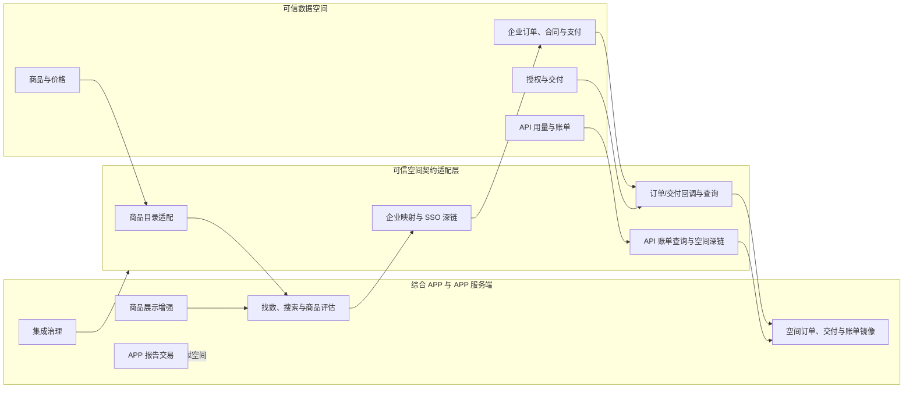
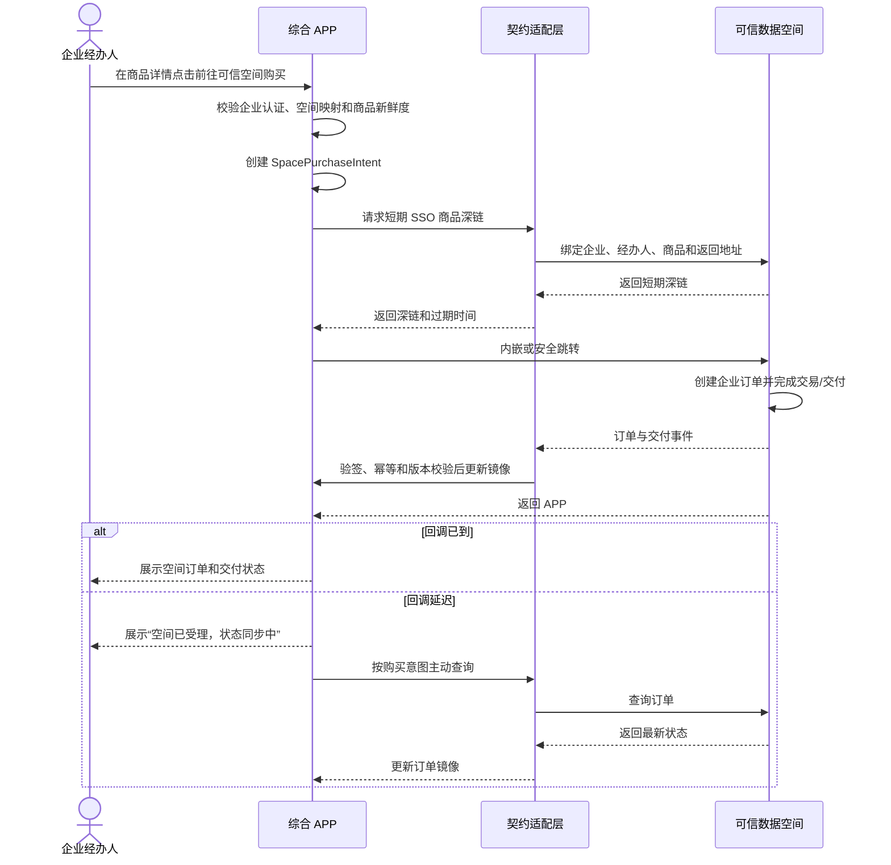

# 找数买数与可信数据空间对接闭环设计

## 1. 文档信息

| 项目 | 内容 |
| --- | --- |
| 日期 | 2026-07-27 |
| 状态 | 设计已确认，待实施计划 |
| 适用范围 | 对外 APP、APP 运营后台、可信数据空间 mock 适配层 |
| 关联文档 | `docs/product/2026-07-09-对外APP找数买数-六层次蓝图与产品设计.md` |
| 现有规格 | `docs/superpowers/specs/2026-07-11-external-app-data-discovery-commerce-design.md` |

## 2. 背景

现有原型已经具备“找数 → 商品详情 → 企业认证 → 可信空间购买承接 → 模拟订单回传”的页面，也具备回调幂等、版本校验、死信和人工修正等集成治理能力，但两条链路尚未真正贯通：

- 可信空间商品仍以静态 mock 为主，商品同步状态没有控制购买入口。
- 空间购买承接页直接创建本地空间订单，并用按钮模拟成功、延迟和不可用。
- 空间订单错误地使用个人作为购买主体，没有区分认证企业和个人经办人。
- 回调集成管线不驱动商品、订单、交付和账单镜像。
- APP 缺少可信空间订单详情和 API 用量账单查询。
- APP 报告支持个人与企业购买的规则没有在收银台显式区分。

本设计通过“契约适配层 + APP 只读镜像”补齐闭环。当前使用 mock 适配器演示真实接口语义；未来取得可信空间接口资料后，仅替换适配器，不重写页面和领域流程。

## 3. 目标与非目标

### 3.1 目标

- 让可信空间商品从目录同步开始，贯通发现、购买前校验、企业身份映射、SSO 商品深链、订单回传、交付查询和 API 账单查询。
- 明确可信空间数据集与 API 只能由认证企业购买，个人账号仅作为经办人。
- 让 APP 可以按权限查看可信空间企业订单、交付状态和 API 用量账单。
- 让 APP 报告在收银台明确选择个人或企业购买主体，并生成对应订单和权益。
- 将现有验签、幂等、版本、重试、死信和人工修正能力接入真实业务镜像。
- 在接口暂不可用、回调延迟、数据过期和未知状态下提供可恢复且不误导的体验。

### 3.2 非目标

- 不接入真实可信空间、支付、合同、授权、交付、充值、开票或财务接口。
- 不在 APP 内复制可信空间的数据访问权益、API 凭证或交付能力。
- 不在 APP 内受理账单异议；用户通过 SSO 深链回可信空间处理。
- 不在本轮建设生产数据库、消息队列、密钥中心或分布式任务调度。
- 不改变数据资产平台的资产治理、商品化加工和出域审批职责。

## 4. 已确认的业务规则

1. 可信空间数据集和 API 只能由已认证企业购买。
2. 空间订单的购买主体是企业，当前个人账号记录为经办人。
3. 可信空间负责空间商品、价格、订单、合同/支付、授权、交付和 API 账单的权威事实。
4. APP 只保存可信空间业务的查询镜像、同步版本、关联编号和本地展示增强，不创建空间数据访问权益。
5. APP 报告可由个人购买，也可由认证企业购买；收银台必须明确选择并确认购买主体。
6. 企业管理员可查看本企业全部空间订单和 API 账单，可下载账单并跳转空间处理疑问。
7. 普通企业成员只查看本人经办的订单，以及本人应用或凭证产生的 API 用量；不显示企业总金额。
8. 未进入已认证企业上下文时，不展示空间订单和账单。
9. 空间商品目录同步纳入闭环；价格或上架状态过期时允许查看最近快照，但禁止购买。
10. APP 只提供账单查询、明细、下载和空间异议入口；异议受理、调整、支付和开票均由可信空间完成。

## 5. 系统边界与主数据归属

### 5.1 APP 负责

- 找数入口、聚合目录、商品详情、说明书、预览和本地增强信息。
- APP 报告的个人/企业购买、APP 订单和 APP 权益。
- 空间购买前置校验、购买意图、SSO 商品深链承接和返回恢复。
- 空间企业订单、交付和 API 账单的只读镜像。
- 回调验签、幂等、版本控制、重试、主动对账、死信和人工修正。

### 5.2 可信空间负责

- 空间商品编号、名称、状态、计价口径、价格和更新时间。
- 空间企业身份、企业订单、合同、支付、授权和交付。
- API 应用、凭证、用量计量、账单金额、账单文件和账单异议。
- 空间订单和账单详情页，以及返回 APP 的安全跳转。

## 6. 四组对接契约

契约以 TypeScript 接口表达业务语义，mock 适配器实现同一接口。真实接口的地址、认证方式和签名算法不在本设计中假定。

### 6.1 商品目录同步

空间商品快照至少包括：

- 空间商品编号和空间商品 ID。
- 商品名称、类型、提供方和销售状态。
- 计价口径、价格摘要和币种。
- 空间更新时间、版本号和同步游标。
- 商品详情或购买深链所需的空间定位信息。

APP 将空间主字段保存为 `TrustedProductSnapshot`，将推荐语、标签、说明书增强、预览和排序保存为独立 `ProductEnhancement`。两者通过空间商品编号绑定。

同步规则：

- 支持全量初始化、增量同步和单商品购买前校验。
- mock 原型默认将 30 分钟内成功校验的快照视为“最新可用”；该阈值以后作为环境配置。
- 快照过期、同步失败或销售状态未知时，商品详情保留最近一次成功快照并标记同步时间，购买入口锁定。
- 空间明确暂停或下架时立即停止新购，不把同步超时误判为下架。
- 同步事件按空间版本号推进，旧版本不得覆盖新快照。

### 6.2 企业映射与 SSO 商品深链

`EnterpriseSpaceBinding` 记录 APP 企业与空间企业的映射，状态包括：

- `unbound`：尚未同步。
- `pending`：同步处理中。
- `active`：映射有效，可以发起空间购买。
- `failed`：映射失败，需要重试或运营处理。

发起购买前必须同时满足：

- 用户处于已认证企业上下文。
- 企业空间映射为 `active`。
- 商品为可信空间数据集或 API。
- 商品快照处于“最新可用”且销售状态允许购买。

满足条件后创建 `SpacePurchaseIntent`，记录：

- APP 企业 ID、空间企业 ID。
- 经办人账号 ID。
- APP 商品 ID、空间商品编号。
- 返回路径、创建时间、过期时间。
- 业务幂等键和跨系统关联编号。

SSO 适配器使用购买意图换取短期商品深链。深链绑定空间企业、经办人、商品、购买意图和 `returnUrl`；长期访问令牌不得暴露给前端。短期凭证失效时复用业务上下文生成新凭证，不重复创建购买意图或本地订单。

### 6.3 订单与交付

空间创建企业订单后，通过回调或主动查询提供：

- 事件 ID、幂等键、事件版本和空间更新时间。
- 空间订单号、购买意图关联编号。
- 空间企业 ID、空间商品编号。
- 原始订单状态、金额、币种和合同/支付摘要。
- 原始交付状态、交付摘要和空间详情深链。

APP 处理顺序：

1. 验证事件来源。
2. 检查幂等键。
3. 校验事件版本和合法状态跃迁。
4. 校验企业、商品和购买意图关联关系。
5. 更新 `SpaceOrderMirror`。
6. 记录 `ConnectorEvent` 审计结果。

回调延迟时，APP 根据购买意图或空间订单号主动查询。重试超过现有集成管线阈值后进入死信；人工修正写入更高处理版本，之后到达的旧事件不得覆盖修正结果。

APP 同时保存空间原始状态和本地展示状态。无法识别的新空间状态统一展示为“处理中”，保留原始状态码供后台排查，不误判为成功或失败。

### 6.4 API 用量账单

`ApiUsageBillMirror` 至少保存：

- 空间账单编号、企业、账期、币种和账单状态。
- 总调用量、成功/失败量、数据量和权威总金额。
- 按 API、应用或凭证、日期拆分的用量与费用明细。
- 空间更新时间、同步版本、最近成功同步时间。
- 账单文件下载地址和账单异议 SSO 深链所需定位信息。

APP 不重算权威金额。账单同步失败时展示上次成功快照、最近同步时间和“数据可能延迟”，不得将未知用量或金额显示为零。

“账单有疑问”使用短期 SSO 深链携带空间企业、经办人、账单编号和 `returnUrl`，由空间完成争议明细选择、举证、受理和处理。返回 APP 后刷新账单结果；APP 不维护本地异议对象或第二套异议状态机。

## 7. 领域对象

### 7.1 可信空间只读镜像

| 对象 | 职责 |
| --- | --- |
| `TrustedProductSnapshot` | 空间商品主字段、版本、同步时间和新鲜度 |
| `EnterpriseSpaceBinding` | APP 企业与空间企业映射 |
| `SpaceOrderMirror` | 空间企业订单、合同/支付摘要、交付和同步版本 |
| `ApiUsageBillMirror` | API 账期、用量、费用、文件和空间深链 |

### 7.2 APP 本地对象

| 对象 | 职责 |
| --- | --- |
| `ProductEnhancement` | 展示标题、推荐语、标签、预览和排序 |
| `SpacePurchaseIntent` | 企业、经办人、商品、返回位置、幂等键和关联编号 |
| `AppOrder` | APP 报告的个人或企业订单 |
| `AppEntitlement` | APP 报告的个人或企业权益 |
| `ConnectorEvent` | 验签、幂等、版本、重试、死信和审计 |

`Order` 不再用 `channel: space` 的本地交易对象模拟空间事实。APP 自营订单与空间订单镜像在领域模型中分开，在用户查询页通过统一展示模型合并。

## 8. 购买与回传流程

### 8.1 可信空间数据集或 API

空间订单成功后不创建 APP 本地数据访问权益。用户通过空间订单或交付详情中的深链前往可信空间使用。

### 8.2 APP 报告

同一报告可以同时支持个人购买和企业购买，但只属于 `app_payment` 交易渠道。

收银台规则：

- 显式展示“个人购买”和“企业购买”。
- 企业购买仅在当前账号处于已认证企业上下文时可选。
- 默认选择当前上下文，但提交前必须再次确认购买主体。
- 个人购买生成个人订单和个人权益。
- 企业购买生成企业订单和企业权益；标准商品可在线支付，大额采购沿用合同流程。
- 订单、权益和退款均由 APP 管理，不经过可信空间。

## 9. 页面设计

### 9.1 商品详情

- APP 报告进入购买主体选择。
- 可信空间数据集/API 先校验企业认证、企业映射、商品状态和价格新鲜度。
- 购买被锁定时展示具体原因和唯一恢复动作。

### 9.2 空间承接页

现有 `SpaceBridge` 从“本地模拟空间收银台”调整为“安全跳转与返回恢复页”：

- 跳转前展示企业、经办人和商品摘要。
- 展示 SSO 深链生成、跳转和返回同步状态。
- SSO 失败时保留购买上下文并允许重试。
- 返回但回调未到时展示同步中并触发主动查询。
- 不再提供“模拟购买成功/回调延迟”的页面按钮；不同场景由 mock 适配器控制。

### 9.3 我的订单

- “个人订单”展示本人 APP 报告订单。
- “企业订单”合并展示 APP 企业报告订单和可信空间企业订单，使用交易渠道标签区分。
- 空间订单展示空间订单号、企业、经办人、商品、金额/币种、合同/支付摘要、交付状态、同步时间和空间详情入口。
- 管理员查看企业全部订单；普通成员只查看本人经办订单。

### 9.4 企业中心—API 用量账单

- 按月份查看账单汇总。
- 按 API、日期以及授权范围内的应用/凭证查看用量与费用明细。
- 支持下载空间账单文件。
- “账单有疑问”跳转可信空间处理。
- 管理员查看企业全部账单和总金额；普通成员只查看本人应用/凭证用量，不显示企业总金额。

### 9.5 运营后台

- 商品中心展示空间同步状态、版本、新鲜度、最近成功时间和手动校验入口。
- 订单中心展示空间订单镜像和主动对账入口。
- 集成治理展示目录、订单、交付和账单事件，支持重试、死信和人工修正。
- 后台不提供本地账单异议处理页。

## 10. 状态设计

### 10.1 商品快照

| 状态 | 含义 | 购买行为 |
| --- | --- | --- |
| `current` | 最近成功校验且空间允许销售 | 允许 |
| `stale` | 超过新鲜度阈值 | 禁止，触发校验 |
| `sync_failed` | 最近同步失败但有历史快照 | 禁止，展示历史快照 |
| `unavailable` | 从未成功同步或无可用快照 | 禁止，展示不可用 |

空间明确的 `paused` 或 `delisted` 属于商品销售状态，不与同步状态混为一轴。

### 10.2 空间购买意图

`validating → ready → redirected → returned_pending_sync → linked`

任一步可以进入 `failed` 或 `expired`。重试生成新的短期 SSO 凭证，但复用有效购买意图和业务幂等键。

### 10.3 空间订单镜像

APP 展示状态包括：

- `accepted`
- `pending_payment`
- `paid`
- `delivering`
- `delivered`
- `failed`
- `cancelled`
- `unknown_processing`

实际对象始终保留空间原始状态。状态映射失败时使用 `unknown_processing`。

## 11. 权限与数据隔离

| 能力 | 企业管理员 | 普通成员 | 未进入认证企业上下文 |
| --- | --- | --- | --- |
| 查看空间企业订单 | 全部 | 本人经办 | 不可见 |
| 查看 API 账单汇总 | 全部 | 不显示企业总金额 | 不可见 |
| 查看 API 用量明细 | 全部 | 本人应用/凭证 | 不可见 |
| 下载账单 | 可 | 仅本人可见范围；若空间不支持部分账单则隐藏 | 不可见 |
| 跳转空间处理账单疑问 | 可 | 仅本人可见范围 | 不可见 |

权限过滤必须在服务或 Store 查询边界完成，不能只依赖页面隐藏。退出企业上下文后，不保留空间订单和账单页面缓存。

## 12. 异常处理

| 异常 | 用户反馈 | 恢复动作 |
| --- | --- | --- |
| 企业未认证 | 说明空间购买仅限认证企业 | 去认证，完成后恢复原商品 |
| 空间企业未映射 | 说明企业信息同步中或失败 | 重试映射或联系运营 |
| 商品状态/价格过期 | 详情可看，购买锁定 | 触发商品校验 |
| SSO 失效 | 保留企业、商品和购买上下文 | 重新生成短期凭证 |
| 空间不可用 | 展示最近商品快照和失败原因 | 稍后重试 |
| 返回 APP 但回调未到 | 显示“空间已受理，状态同步中” | 自动主动查询 |
| 重复回调 | 不改变当前订单 | 幂等忽略并审计 |
| 旧版本回调 | 不允许状态回退 | 丢弃旧事件并审计 |
| 验签失败 | 不更新任何业务状态 | 拒绝、记录并告警 |
| 企业/商品/意图不匹配 | 不把订单关联给用户 | 进入死信和人工修正 |
| 账单同步失败 | 展示上次成功快照和同步时间 | 重试同步，不显示伪造零值 |

## 13. 测试策略

### 13.1 领域规则测试

- 可信空间商品只能由认证企业购买。
- 空间订单主体是企业，经办人是当前个人账号。
- APP 报告个人/企业购买生成不同订单与权益。
- 商品新鲜度和销售状态共同控制购买。
- 空间订单状态只能按版本和合法跃迁推进。
- 未知空间状态降级为“处理中”。
- 管理员、成员和非企业上下文的数据范围正确。

### 13.2 契约测试

- 商品目录字段映射和版本推进。
- SSO 商品深链绑定企业、经办人、商品、购买意图和返回地址。
- 订单/交付事件验签、幂等、乱序和关联校验。
- API 账单汇总、明细、下载和空间异议深链映射。

### 13.3 Store 集成测试

- 回调处理后更新正确企业和商品的空间订单镜像。
- 返回早于回调时主动查询补齐订单。
- 多次失败进入死信，人工修正后旧事件不能覆盖结果。
- 账单同步失败保留历史快照。
- 企业之间订单和账单严格隔离。

### 13.4 页面与浏览器验证

- 找数 → 商品详情 → 企业认证 → 空间跳转 → 返回同步 → 企业订单。
- 企业订单 → 空间交付详情。
- 企业中心 → API 账单 → 明细/下载 → 空间处理疑问 → 返回刷新。
- APP 报告 → 个人/企业主体选择 → 对应订单与权益。
- 商品过期、空间不可用、回调延迟、死信和权限不足状态。

## 14. Prototype Decision

| Need prototype? | Reason |
| --- | --- |
| Yes | 本轮需要验证跨系统状态、企业购买主体、订单/交付镜像、API 账单权限和异常恢复；现有 Vue 原型可通过 mock 适配器展示完整闭环 |

本轮继续使用 `external-app-vue3`，不新建独立原型。可信空间接口全部通过可替换的 mock 适配器实现。

## 15. 验收标准

- 可信空间商品同步成功后可被找数检索；同步过期时详情仍可看但不能购买。
- 未认证用户不能购买数据集/API。
- 认证企业购买时，订单主体为企业、经办人为当前账号。
- 返回 APP 但回调延迟时显示同步中，主动查询后正确关联空间订单。
- 重复或旧版本回调不重复建单，也不能让“已交付”回退。
- 空间订单成功后不创建 APP 本地数据访问权益，并可前往空间使用。
- 企业管理员可看企业全部空间订单和 API 账单。
- 普通成员只能看本人经办订单和本人应用/凭证用量，不显示企业总金额。
- API 账单支持月度汇总、日/API 明细、下载和携带上下文回空间处理疑问。
- APP 报告选择个人或企业主体后生成对应订单与本地权益。
- 同步或回调多次失败进入后台死信，人工修正后旧事件不能覆盖结果。
- 相关测试、类型检查、构建和移动端/PC 端冒烟验证通过。

## 16. 实施与回退建议

实施顺序：

1. 先建立领域对象、状态决策和适配器接口。
2. 以 mock 适配器接通目录、企业映射、SSO、订单/交付和账单。
3. 改造空间承接页、订单页、企业账单页和后台集成治理。
4. 补齐契约、Store、组件和端到端冒烟测试。
5. 同步产品蓝图、功能矩阵、README 和交付说明。

回退时可将可信空间适配器切回只读 seed 数据，但不得恢复“页面按钮直接伪造空间购买成功”的旧逻辑。由于原型状态为内存 mock，不涉及生产数据迁移或破坏性回滚。

## 17. 文档同步

实施完成后同步：

- `docs/product/2026-07-09-对外APP找数买数-六层次蓝图与产品设计.md`
- `docs/product/2026-07-10-对外APP找数买数-功能矩阵.md`
- `external-app-vue3/README.md`
- 对应实施计划和验证记录

本需求没有指定发布版本或飞书目标文档，本轮不宣称已同步飞书。
